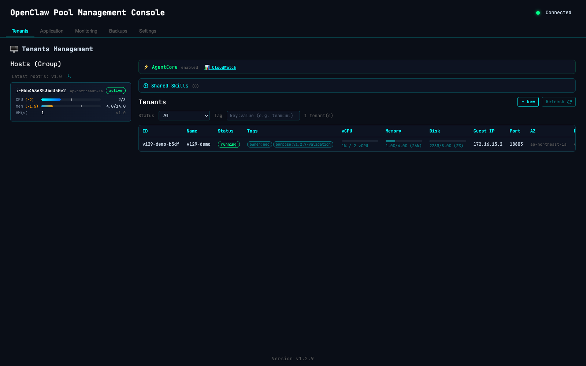
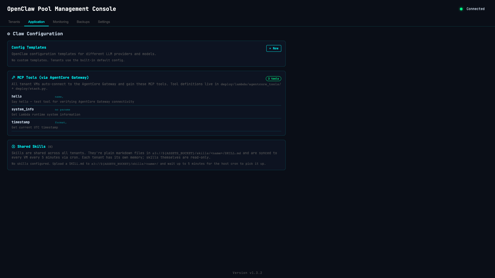
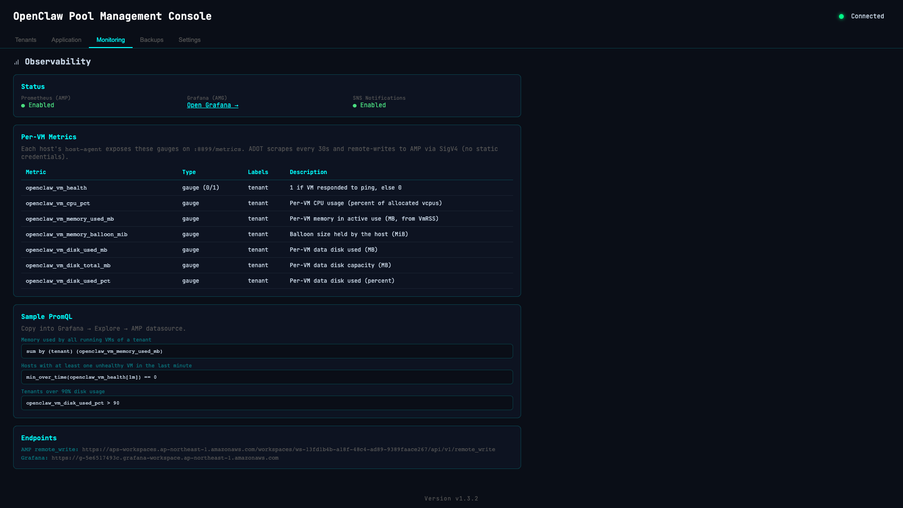
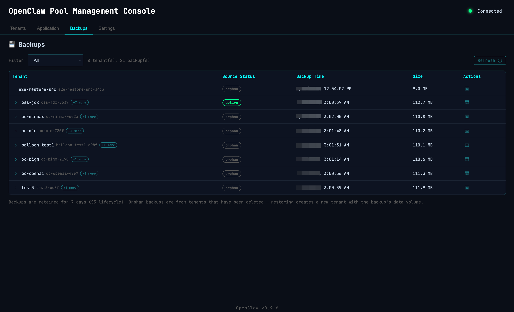
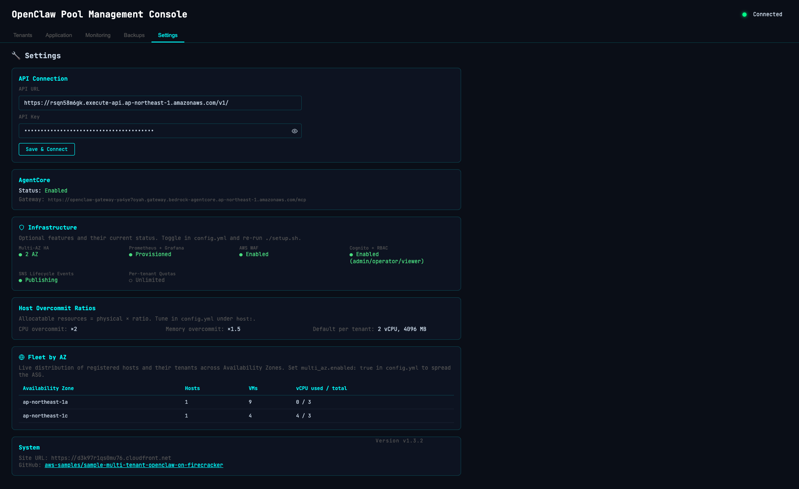
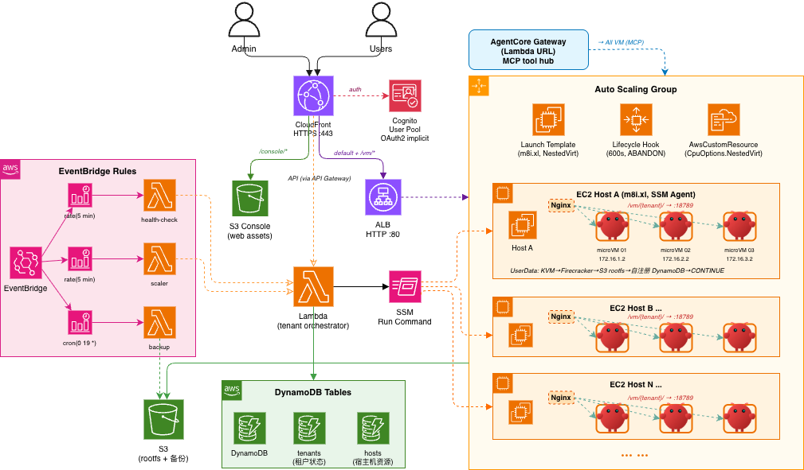
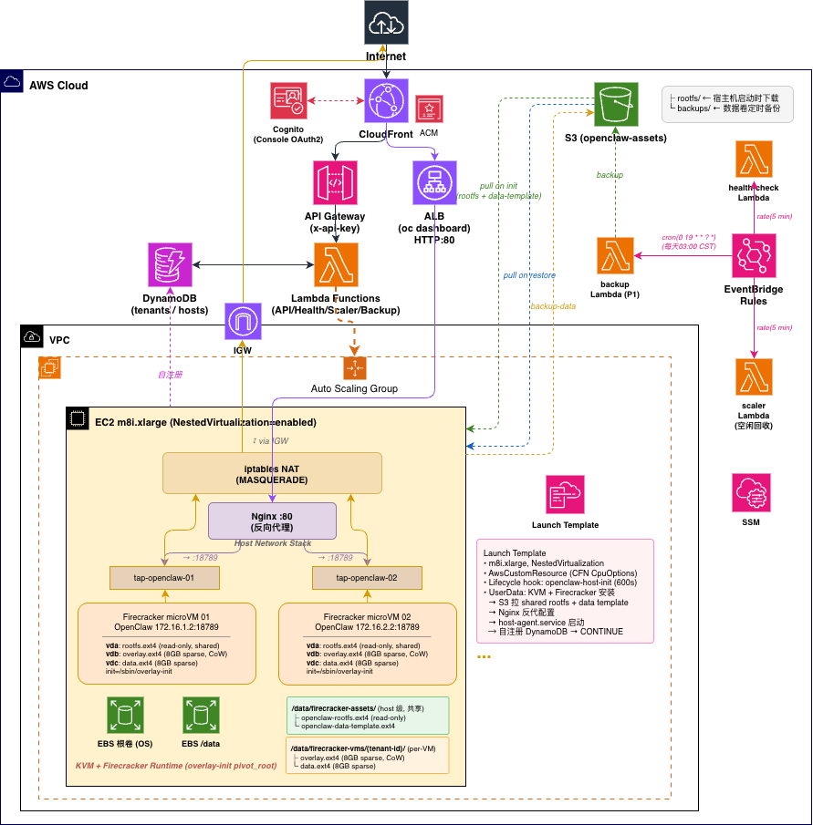

<h1 align="center">🦞 OpenClaw Pool</h1>

<p align="center">
  <b>Production-grade multi-tenant AI agents on AWS, isolated by Firecracker microVMs</b><br/>
  <i>Strong isolation · Real failover · Full observability · 5-minute one-click deploy</i>
</p>

<p align="center">
  <a href="https://github.com/aws-samples/sample-multi-tenant-openclaw-on-firecracker/blob/main/LICENSE">
    
  </a>
  <a href="https://github.com/aws-samples/sample-multi-tenant-openclaw-on-firecracker/releases/latest">
    
  </a>
  <a href="https://github.com/aws-samples/sample-multi-tenant-openclaw-on-firecracker/stargazers">
    
  </a>
  <a href="https://github.com/aws-samples/sample-multi-tenant-openclaw-on-firecracker/network/members">
    
  </a>
  <a href="https://github.com/aws-samples/sample-multi-tenant-openclaw-on-firecracker/issues">
    
  </a>
  
</p>

<p align="center">
  
  
  
  
  
  
  
  
</p>

<p align="center">
  <b>📖 Read in:</b>
  <a href="README.md">English</a> ·
  <a href="docs/README-CN.md">中文</a>
</p>

<p align="center">
  <a href="#-quick-start">Quick Start</a> ·
  <a href="#-features">Features</a> ·
  <a href="#%EF%B8%8F-web-console">Console</a> ·
  <a href="#%EF%B8%8F-architecture">Architecture</a> ·
  <a href="#-api-reference">API</a> ·
  <a href="https://github.com/aws-samples/sample-multi-tenant-openclaw-on-firecracker/releases/latest">Releases</a> ·
  <a href="CHANGELOG.md">Changelog</a>
</p>

---

<p align="center">
  
  <br/>
  <i>Real production deployment — tenants distributed across 2 AZs, live CPU/Memory/Disk metrics, one-click migration & dashboard access.</i>
</p>

> ⚠️ **Disclaimer**: This sample is for demonstration purposes only and is not intended for production use. Deploy at your own risk.
>
> 💡 **Note**: This project uses AWS EC2 [nested virtualization](https://docs.aws.amazon.com/AWSEC2/latest/UserGuide/nested-virtualization.html) to run KVM + Firecracker inside EC2 instances. Currently supports Intel instance families (c8i / m8i / r8i) and Graviton (ARM64).

---

## ✨ Why OpenClaw Pool?

<table>
<tr>
<td width="50%" valign="top">

**🔒 Strong isolation by design**
Each tenant runs in its own Firecracker microVM — same lightweight virtualization powering AWS Lambda and Fargate. Independent kernel, OverlayFS rootfs, /24 subnet, KMS-encrypted EBS. Not Linux namespaces sharing one kernel.

**🛡 Real, battle-tested AZ failover**
Default 2-host multi-AZ deployment + automatic AZ failover. Verified end-to-end on real AWS — multi-tenant simultaneous failover with 2/2 dashboards back to HTTP 200 in ~90s. Six deep race conditions hunted down and locked in by unit tests.

**🤖 Bedrock AgentCore native**
One toggle and every microVM auto-connects to AgentCore Gateway, Memory, Code Interpreter, Browser, and Workload Identity. Among the few AWS Samples that fully wire all five AgentCore components.

</td>
<td width="50%" valign="top">

**📊 Full-stack observability, zero static creds**
Amazon Managed Prometheus + Grafana out of the box. ADOT collector auto-signs SigV4 from each host. Six per-VM gauges (`openclaw_vm_cpu_pct`, `memory_used_mb`, `disk_used_pct`, …) + audit log + console PromQL examples.

**⚡ High density at low cost**
CPU 2× / memory 1.5× overcommit (Firecracker balloon). Spot instance support saves 60–70%. Per-tenant quotas guard against noisy neighbors. ~100 tenants on $250/month vs $2000 for one-EC2-per-tenant.

**🚀 One-command CDK deploy**
`./setup.sh <region> <profile>` brings up the full stack in 5 minutes — VPC, ASG, ALB, Lambda, DynamoDB, AMP, Cognito, AgentCore, all wired and ready. Cloud rootfs build means **no local Linux required** (works from macOS / Windows).

</td>
</tr>
</table>

---

## 📑 Table of Contents

- [🚀 Quick Start](#-quick-start)
- [🎯 Features](#-features)
- [🖥️ Web Console](#%EF%B8%8F-web-console)
- [🏗️ Architecture](#%EF%B8%8F-architecture)
- [⚙️ Configuration](#%EF%B8%8F-configuration)
- [📚 API Reference](#-api-reference)
- [🌐 Advanced Topics](#-advanced-topics)
- [⬆️ Upgrade Guide](#%EF%B8%8F-upgrade-guide)
- [🤝 Contributing](#-contributing)
- [📄 License](#-license)

---

## 🚀 Quick Start

> **Prerequisites**: AWS account + CLI configured · CDK CLI · Python 3.12+ · [uv](https://docs.astral.sh/uv/) package manager

```bash
# 1️⃣ Clone & configure
git clone https://github.com/aws-samples/sample-multi-tenant-openclaw-on-firecracker
cd sample-multi-tenant-openclaw-on-firecracker
cp config.yml.example config.yml                                  # tweak as needed
cp templates/openclaw.json.example templates/openclaw.json        # set your LLM API key

# 2️⃣ One-click CDK deploy (~5 min) — provisions VPC, ASG, ALB, Lambda, DynamoDB,
#                                    AMP, Grafana, Cognito, AgentCore, KMS, WAF
./setup.sh ap-northeast-1 your-aws-profile

# 3️⃣ Build the rootfs (~10 min, one-time, cloud-native — no local Linux required)
./scripts/build-rootfs-on-ec2.sh v1.0

# 4️⃣ Create your first tenant
source .env.deploy
curl -s -X POST "${API_URL}tenants" -H "x-api-key: ${API_KEY}" \
  -d '{"name":"my-first-agent","vcpu":2,"mem_mb":4096}' | jq .
```

> Open the Console URL printed at the end of `setup.sh` to manage tenants from a browser. Every tenant gets a one-click HTTPS dashboard with no custom domain or certificate required.

---

## 🎯 Features

> Everything that ships out of the box. Nine categories, each independently toggleable in `config.yml`.

<details open>
<summary><b>🔒 Strong Isolation</b> — Firecracker microVM, independent kernel, /24 subnet, EBS encryption</summary>

| Capability | Detail |
|---|---|
| **Firecracker microVM** | Each tenant in its own KVM-based microVM (same tech as Lambda/Fargate). Boot ~200ms. |
| **Independent kernel** | Per-tenant Linux kernel — kernel panics don't leak across tenants. |
| **OverlayFS rootfs** | Read-only base + per-tenant writable layer. Sparse, doesn't pre-allocate. |
| **EBS encryption at rest** | KMS-encrypted by default for both rootfs and data volumes. |
| **Independent /24 subnet** | `172.16.N.0/24` per VM with a dedicated tap device. |
| **iptables network isolation** | Cross-tenant routing **DROP**ed by default — must be explicitly allowed. |
| **PID namespace** | Host can't see guest processes; guests can't see each other. |

</details>

<details open>
<summary><b>🛡 High Availability — Multi-AZ + Automatic AZ Failover</b> (v1.3.x flagship)</summary>

| Capability | Detail |
|---|---|
| **Default 2-host Multi-AZ** | `min_capacity: 2` + `multi_az.enabled: true` are defaults — HA is opt-out, not opt-in. |
| **Automatic AZ failover** | Lambda detects AZ outages every 5 min, migrates affected tenants to a healthy AZ. |
| **30-min cooldown** | Per-AZ debounce against flapping outages. |
| **ALB rule auto-tracking** | Tenant migration auto-updates ALB listener rules — Dashboard URL never changes. |
| **Backup-required policy** | Path A: tenant has no backup → refuse to migrate + SNS alert (data safety > availability). |
| **Concurrent Lambda safety** | `reserved_concurrent_executions=1` + DDB ConditionalCheck → no race conditions. |
| **SSM-vs-VM verify probe** | Cross-checks `pgrep firecracker` + nginx conf — distinguishes "real failure" from "misleading SSM exit". |
| **Audit log** | Every failover event — `AZ_OUTAGE_DETECTED`, `AZ_FAILOVER_RECOVERED_BY_VERIFY`, etc. |

> **Real-environment proof (v1.3.2)**: 2 tenants on the failed AZ, both back to `status=running` + Dashboard HTTP 200 in ~90s. `tenants_failed_over: 2, tenants_failed: 0, tenants_blocked: 0`.

</details>

<details>
<summary><b>🔧 Complete Tenant Lifecycle</b> — 12 first-class operations, all available via API + Console</summary>

| Operation | API | What it does |
|---|---|---|
| **Create / Delete** | `POST /tenants` / `DELETE /tenants/{id}` | Spawn / remove a tenant. `?keep_data=true` preserves the data volume. |
| **Restart / Reset** | `/restart` / `/reset` | Restart VM (fast); reset reinstalls rootfs but preserves data. |
| **Stop / Start** | `/stop` / `/start` | Offline but keep disks. |
| **Pause / Resume** | `/pause` / `/resume` | Firecracker-native vCPU freeze (instant). |
| **Backup** | `/backup` | Manual snapshot of data volume to S3. |
| **Hot-resize vCPU** | `/resize` | Add vCPU online without restart. |
| **Resize disk** | `/resize-disk` | Grow the data volume; `resize2fs` runs automatically. |
| **Live migrate** | `/migrate` | Snapshot/restore to another host — Dashboard URL unchanged. |
| **Clone** | `clone_from` on create | Same-host `cp` of the data volume — much faster than backup-restore. |
| **Restore** | `restore_from` on create | Restore from any backup (orphan or active). |
| **Tags + TTL + schedule** | Body fields on create | Tag-based filter, auto-stop on TTL, office-hours schedule. |
| **Batch operations** | `POST /batch/tenants` | `stop` / `start` / `delete` / `backup` by ID list or tag filter. |

</details>

<details>
<summary><b>⚡ Resource Elasticity</b> — ASG, overcommit, Spot, quotas, Graviton</summary>

| Capability | Detail |
|---|---|
| **ASG auto-scale** | New EC2 host on demand; idle hosts reclaimed after two-round confirmation. |
| **CPU overcommit** | `cpu_overcommit_ratio: 2.0` → 8 physical vCPU = 16 allocatable. |
| **Memory overcommit** | `mem_overcommit_ratio: 1.5` + Firecracker balloon → 32 GiB physical = 48 GiB allocatable. |
| **Spot instances** | `asg.use_spot: true` saves 60–70%. ASG auto-replaces preempted hosts. |
| **Per-tenant quotas** | `QUOTAS_MAX_VCPU/MEM/DATA_DISK_MB` blocks oversized tenants at create-time. |
| **Graviton (ARM64)** | `instance_type: r8g.2xlarge` ✅ — rootfs builds for both arches. |

</details>

<details>
<summary><b>📊 Observability</b> — Two-tier health + Prometheus + Grafana, zero static credentials</summary>

| Capability | Detail |
|---|---|
| **host-agent (5s)** | Per-host systemd service polling all VMs and writing live metrics to DynamoDB. |
| **Lambda watchdog (5min)** | Cross-fleet sweep, AZ-outage detection, failover orchestration. |
| **Amazon Managed Prometheus** | Fully-managed AMP workspace with PromQL compatibility. |
| **Amazon Managed Grafana** | IAM Identity Center login + AMP datasource + sample dashboards. |
| **ADOT collector** | Auto SigV4-signed remote-write — no static credentials anywhere. |
| **6 per-VM gauges** | `openclaw_vm_health`, `cpu_pct`, `memory_used_mb`, `memory_balloon_mib`, `disk_used_mb`, `disk_used_pct` — all labeled by `tenant` and `instance`. |
| **Audit log** | Every mutating API call → DynamoDB with 90-day TTL; queryable via `GET /audit-log`. |

</details>

<details>
<summary><b>🤖 Bedrock AgentCore Integration</b> — Optional one-toggle, full 5-component wire-up</summary>

| Component | Role |
|---|---|
| **Gateway** | MCP tool hub — Lambda functions exposed as MCP tools. Three demo tools: `hello`, `system_info`, `timestamp`. |
| **Memory** | Multi-turn conversation context. `create_event` / `list_events` / `batch_create_memory_records`. Per-tenant isolation. |
| **Code Interpreter** | Python 3.12 sandbox. `start_session` → `executeCode` → `stop_session`. |
| **Browser** | Remote Chromium with WebSocket stream. Automation-ready. |
| **Workload Identity** | Each VM auto-injected with temporary credentials at boot — no static keys, auto-refresh. |

> Among the few AWS Samples projects that wire **all five AgentCore components** end-to-end and verify them with E2E tests.

</details>

<details>
<summary><b>💾 Backup & Restore</b> — Scheduled, manual, cross-tenant, orphan-safe</summary>

| Capability | Detail |
|---|---|
| **Scheduled backups** | EventBridge cron — every running tenant's data volume → S3 daily. |
| **Manual trigger** | `POST /tenants/{id}/backup` — async, returns 202. |
| **Orphan-safe restore** | Source tenant can be deleted; backup remains restorable into a new tenant. |
| **S3 lifecycle** | `backup_retention_days` controls automatic cleanup (default 7 days). |
| **Trap-safe** | VM auto-resumes even if compress/upload fails — no stuck `paused` state. |
| **Pause-compress-resume** | Atomic: pause → pigz compress → upload → resume — sub-second guest interruption. |

</details>

<details>
<summary><b>🔐 Security & Compliance</b> — Defense in depth, 7 independent layers</summary>

| Layer | Implementation |
|---|---|
| **Encryption at rest** | EBS volumes (rootfs + data) KMS-encrypted by default. |
| **Encryption in transit** | CloudFront → ALB → Nginx → VM Gateway, all TLS. |
| **API authentication** | API Gateway with `x-api-key` + optional AWS WAF (rate limit, geo block, OWASP). |
| **Console authentication** | Cognito OAuth2 implicit flow + optional MFA. |
| **RBAC** | Cognito Groups: `admin` / `operator` / `viewer` enforced per-route. |
| **Audit log** | All `POST` / `PUT` / `DELETE` operations recorded with 90-day TTL. |
| **Network isolation** | iptables `FORWARD DROP` between tenant subnets — cross-tenant traffic explicitly disabled. |

</details>

<details>
<summary><b>🚀 Easy Deployment</b> — One-command CDK + cloud-native rootfs build</summary>

| Capability | Detail |
|---|---|
| **One-command setup** | `./setup.sh <region> <profile>` — full CDK stack in ~5 min. |
| **Cloud rootfs build** | `./scripts/build-rootfs-on-ec2.sh` — spins up a one-shot EC2 host + SSM, no local Linux. |
| **Custom domain** | `./setup.sh --domain claw.example.com --cert <acm-arn>` — ACM in `us-east-1`. |
| **Cognito + RBAC** | Optional auth; admin / operator / viewer groups gate all mutating APIs. |
| **Manifest-based rootfs versioning** | `manifest.json` tracks rootfs versions; per-host registry. |
| **Terraform parity** | Terraform module mirrors the CDK stack for teams already on Terraform. |

</details>

---

## 🖥️ Web Console

Web-based console hosted on CloudFront (`/console/`), Cognito-authenticated. Five tabs covering everything an operator needs.

### Tenants tab — Multi-host, multi-AZ live operations

Hosts grouped by AZ on the left (each card showing CPU / Memory / VM count and overcommit ratios). Tenants table with live vCPU / Memory / Disk progress bars per row, AZ column, gateway / health LEDs, and per-tenant Migrate button. AgentCore + Shared Skills surfaces collapsed at the top:


### Application tab — Templates, MCP tools, shared skills

Config Templates manager + MCP Tools card (auto-populated via AgentCore Gateway, surfacing every Lambda-backed tool registered with the gateway: name, description, input schema) + Shared Skills with per-skill S3 deep-links:



### Monitoring tab — AMP / Grafana / SNS at a glance

Observability page: AMP / Grafana / SNS status, full per-VM Prometheus gauge inventory with types + labels + descriptions, copy-pasteable sample PromQL queries, and AMP `remote_write` / Grafana endpoints:



### Backups tab — Cross-tenant explorer with orphan support

Cross-tenant explorer marking active vs orphan backups (orphan = source tenant deleted, but the backup is still restorable into a fresh tenant). 7-day S3 lifecycle by default:



### Settings tab — Infrastructure status & Fleet by AZ

At-a-glance infrastructure status: API connection, AgentCore Gateway URL, Multi-AZ HA, Prometheus + Grafana, AWS WAF, Cognito + RBAC, SNS lifecycle events, per-tenant quotas, host overcommit ratios, and a live **Fleet by AZ** table showing how hosts and VMs are spread across availability zones:



---

## 🏗️ Architecture

### System Architecture



### Deployment Architecture



<details>
<summary><b>ASCII version (for AI/text access)</b></summary>

```
Admin / User
    │
    ├── API Gateway (HTTPS, x-api-key) ──→ Lambda ──→ DynamoDB
    │                                                  ├── tenants
    │                                                  └── hosts
    │
    └── ALB (HTTPS) ──→ Host Nginx:80 ──→ VM Gateway:18789
                        ├── /vm/{tenant-a}/ → 172.16.1.2
                        └── /vm/{tenant-b}/ → 172.16.2.2

Lambda ── SSM Run Command ──→ EC2 Host
                               ├── microVM 01 (172.16.1.2)
                               ├── microVM 02 (172.16.2.2)
                               └── ...

S3: rootfs distribution + data backup + shared skills
ASG: auto-scaling hosts
EventBridge: health checks + idle reclamation + scheduled backup
```

</details>

### Network Model

Each VM uses an independent /24 subnet, communicating with the host via TAP device:

```
VM1: tap-vm1  host=172.16.1.1/24  guest=172.16.1.2/24
VM2: tap-vm2  host=172.16.2.1/24  guest=172.16.2.2/24
VMn: tap-vmN  host=172.16.N.1/24  guest=172.16.N.2/24
```

- **Outbound**: iptables MASQUERADE → internet
- **Inbound**: ALB → Nginx reverse proxy → VM:18789
- **Inter-VM**: fully isolated, no routing between subnets

### Project Structure

```
sample-multi-tenant-openclaw-on-firecracker/
├── deploy/                    # CDK project
│   ├── app.py                 # CDK app entry
│   ├── stack.py               # Infrastructure definition
│   ├── lambda/
│   │   ├── api/handler.py             # Tenant CRUD + host management
│   │   ├── templates/handler.py       # Config template CRUD
│   │   ├── skills/handler.py          # Shared skills list
│   │   ├── health_check/handler.py    # Scheduled health + AZ failover
│   │   ├── agentcore_tools/handler.py # AgentCore Gateway Lambda tools
│   │   └── scaler/handler.py          # Idle host reclamation
│   └── userdata/
│       ├── init-host.sh       # Host initialization
│       ├── host-agent.py      # VM health polling + DDB writes + balloon
│       ├── launch-vm.sh       # microVM launch
│       └── stop-vm.sh         # microVM stop
├── console/                   # Web management console
├── tests/                     # 426+ tests (unit / integration / e2e)
├── templates/                 # OpenClaw config templates
├── scripts/
│   ├── build-rootfs-on-ec2.sh # Cloud build (no local Linux required)
│   ├── destroy.sh             # Tear down stack
│   ├── oc-connect.sh          # SSH-style helper to reach a tenant VM
│   └── oc-dashboard.sh        # Open a tenant's Dashboard URL
├── pyproject.toml             # Python project config
├── cdk.json                   # CDK app config + feature flags
├── config.yml.example         # Infrastructure config template
└── setup.sh                   # One-click deploy + .env.deploy export
```

---

## ⚙️ Configuration

### Config files

| File | Purpose |
|---|---|
| `config.yml` | Infrastructure config — copy from `config.yml.example` and customize |
| `templates/openclaw.json` | OpenClaw app config (model, API key, provider) |
| `.env.deploy` | Deploy environment (region, API URL/Key, bucket) — auto-generated by `setup.sh` |

### Key `config.yml` knobs

| Section | Key | Default | Description |
|---|---|---|---|
| `host` | `instance_type` | `m8i.2xlarge` | Must support nested virtualization (c8i / m8i / r8i / r8g). |
| `host` | `cpu_overcommit_ratio` | `2.0` | CPU overcommit factor. |
| `host` | `mem_overcommit_ratio` | `1.0` | Memory overcommit (requires balloon enabled). |
| `vm` | `default_vcpu` | `2` | Default vCPU per tenant. |
| `vm` | `default_mem_mb` | `4096` | Default memory (MB) per tenant. |
| `balloon` | `enabled` | `false` | Firecracker balloon device for memory overcommit. |
| `asg` | `min_capacity` | `2` | Minimum host instances (default Multi-AZ). |
| `asg` | `use_spot` | `false` | Spot instances (60–70% savings, may be reclaimed). |
| `multi_az` | `enabled` | `true` | Multi-AZ HA — enables AZ failover. |
| `health_check` | `interval_minutes` | `5` | Lambda watchdog interval. |
| `metrics` | `enabled` | `false` | Provision AMP + Grafana + ADOT. |
| `agentcore` | `enabled` | `false` | Provision Gateway + Memory + CodeInterpreter + Browser + Identity. |
| `console_auth` | `enabled` | `false` | Cognito authentication for Console. |
| `backup_cron` | — | `cron(0 19 * * ? *)` | UTC 19:00 daily backups. |

> See [`config.yml.example`](config.yml.example) for the complete reference.

### Tear down

```bash
./scripts/destroy.sh           # Destroy stack, keep S3 + DynamoDB
./scripts/destroy.sh --purge   # Full cleanup including data
```

---

## 📚 API Reference

All requests require the `x-api-key` header.

### Tenants

| Method | Path | Description |
|---|---|---|
| `GET` | `/tenants` | List all tenants. Filter with `?tag=key:value` (repeatable, AND across pairs). |
| `POST` | `/tenants` | Create. Body: `{name, vcpu, mem_mb, data_disk_mb, config_template, tags, ttl_hours, on_expiry, schedule, restore_from, clone_from}` — only `name` required. |
| `GET` | `/tenants/{id}` | Get tenant details. |
| `DELETE` | `/tenants/{id}` | Delete (`?keep_data=true` preserves data volume). |
| `POST` | `/tenants/{id}/restart` | Restart VM (reuse disks). |
| `POST` | `/tenants/{id}/stop` · `/start` | Stop / start. |
| `POST` | `/tenants/{id}/pause` · `/resume` | Firecracker-native vCPU freeze / resume. |
| `POST` | `/tenants/{id}/reset` | Reinstall rootfs (data preserved). |
| `POST` | `/tenants/{id}/backup` | Manual data backup. |
| `POST` | `/tenants/{id}/resize` | Hot-add vCPU. Body: `{"vcpu":4}`. |
| `POST` | `/tenants/{id}/resize-disk` | Offline grow data disk. Body: `{"new_size_mb":16384}`. |
| `POST` | `/tenants/{id}/migrate` | Live migration. Body: `{"target_host_id":"i-..."}`. |
| `GET` | `/tenants/{id}/backups` | Backups for one tenant. |
| `POST` | `/batch/tenants` | Batch op. Body: `{"action":"stop\|start\|delete\|backup", "ids":[...]\|"filter":{"tag":"k:v"}}`. |

### Backups, Hosts, AgentCore, Audit, Skills, Templates

| Method | Path | Description |
|---|---|---|
| `GET` | `/backups` | List all backups across tenants (marks orphan vs active). |
| `GET` | `/hosts` | List all hosts. |
| `POST` | `/hosts/refresh-rootfs` | Push latest rootfs to all hosts. |
| `GET` | `/hosts/rootfs-version` | Query current rootfs version. |
| `GET` | `/agentcore/status` | AgentCore enable status + Gateway URL. |
| `GET` | `/agentcore/tools` | List MCP tools registered with Gateway. |
| `GET` | `/audit-log` | Query audit log. `?since=<ISO8601>&limit=<n>` — 90-day TTL. |
| `GET` | `/skills` | List shared skills (S3-managed). |
| `GET` · `PUT` · `DELETE` | `/templates/{name}` | CRUD for config templates (`default` is read-only). |
| `GET` | `/system/info` | Feature flags + config snapshot (region, version, multi_az, metrics, …). |

---

## 🌐 Advanced Topics

<details>
<summary><b>Auto Backup & Restore — flow + restore from any backup (orphan-safe)</b></summary>

EventBridge schedules daily backups of all running tenant data volumes to S3. Manual trigger also supported.

**Backup flow**: pause VM → `pigz` compress `data.ext4` → resume VM → upload to S3. VM auto-resumes even on failure (trap cleanup).

```bash
source .env.deploy

# Manual backup (async, returns 202)
curl -s -X POST "${API_URL}tenants/{id}/backup" -H "x-api-key: ${API_KEY}" | jq .

# List all backups across tenants (marks orphan vs active)
curl -s "${API_URL}backups" -H "x-api-key: ${API_KEY}" | jq .
```

**Restore from backup** (orphan-safe — source tenant need not exist):

```bash
# Restore from the latest backup of a (possibly deleted) tenant
curl -s -X POST "${API_URL}tenants" -H "x-api-key: ${API_KEY}" -d '{
  "name": "restored-agent",
  "vcpu": 2, "mem_mb": 4096,
  "restore_from": {"tenant_id": "my-agent-ab12"}
}' | jq .

# Restore from a specific backup timestamp
curl -s -X POST "${API_URL}tenants" -H "x-api-key: ${API_KEY}" -d '{
  "name": "restored-agent",
  "restore_from": {"tenant_id": "my-agent-ab12", "timestamp": "20260428-125402"}
}' | jq .
```

</details>

<details>
<summary><b>🔐 Multi-Domain Setup — Security Hardening (v1.3.4+, recommended for production)</b></summary>

**Why split domains?** When `console/*` and `vm/*` share one CloudFront distribution and one domain:

- Cognito session cookie is set on the parent domain → automatically sent to `/vm/*` requests
- A tenant dashboard rendering unescaped user input (XSS) gets full same-origin access to the operator console DOM → can steal admin tokens
- All tenant dashboards share the same blast radius

**Dual-domain mode** creates two independent CloudFront distributions, each with its own ACM cert. Cognito session cookie is physically scoped to `console_domain` and cannot be sent to `app_domain` — browser policy enforces this at the protocol level.

```bash
# Prerequisites:
#   1. Request TWO ACM certs in us-east-1 (one for console_domain, one for app_domain)
#   2. CNAME both domains to their respective CloudFront distributions after deploy

./setup.sh ap-northeast-1 lab \
  --console-domain console.example.com --console-cert arn:aws:acm:us-east-1:xxx:certificate/console-xxx \
  --app-domain     app.example.com     --app-cert     arn:aws:acm:us-east-1:xxx:certificate/app-xxx
```

After deploy, `setup.sh` prints two distinct URLs:

```
→ Console URL:    https://console.example.com/console/index.html  (operator login)
→ Dashboard URL:  https://app.example.com/vm/<tenant-id>/         (per-tenant)
  ✓ Dual-domain mode active — Cognito session physically isolated from tenant dashboards
```

| Property | Single-domain (legacy) | **Dual-domain (recommended)** |
|---|---|---|
| CloudFront distributions | 1 | 2 |
| ACM certificates | 1 | 2 |
| Cookie scope | shared origin | **console_domain only** |
| XSS blast radius | all dashboards + console | tenant only |
| `OC_CONSOLE_BASE` / `OC_DASHBOARD_BASE` | same | different |

The legacy `--domain` / `--cert` flags still work for dev/sample deployments.

</details>

<details>
<summary><b>Shared Skills — S3 → Host → VM sync chain (with per-tenant / per-group scoping)</b></summary>

All tenants share a unified skill catalog (`SKILL.md` files) with independent memory per tenant.

```bash
# Upload skills to S3 (auto-synced to all hosts, then injected at VM launch)
aws s3 sync ./my-skills/ s3://${ASSETS_BUCKET}/skills/ --profile $PROFILE

# Sync chain:
#   S3 → Host /data/shared-skills/ (cron 5min) → New VMs at launch
```

**1.4.0 (#62) — per-tenant / per-group skill distribution**: by default every VM gets every skill (broadcast, legacy v1.3.x behavior). To restrict which skills a particular tenant receives:

```bash
# 1) Define a group of skills (optional)
curl -s -X POST "${API_URL}groups" -H "x-api-key: ${API_KEY}" -d '{
  "name": "team-sre",
  "skills": ["k8s-debug", "incident-response"],
  "description": "SRE team standard tools"
}'

# 2a) Per-tenant scoping (only this tenant's skills get cp'd at launch)
curl -s -X POST "${API_URL}tenants" -H "x-api-key: ${API_KEY}" -d '{
  "name": "research-agent",
  "vcpu": 2, "mem_mb": 4096,
  "skills": ["web-search", "code-review"]
}'

# 2b) Group-only scoping
curl -s -X POST "${API_URL}tenants" -H "x-api-key: ${API_KEY}" -d '{
  "name": "sre-bot",
  "group": "team-sre"
}'

# 2c) Both — effective set = tenant.skills ∪ group.skills
curl -s -X POST "${API_URL}tenants" -H "x-api-key: ${API_KEY}" -d '{
  "name": "sre-extras",
  "skills": ["pagerduty"],
  "group": "team-sre"
}'

# Inspect what a tenant will actually receive
curl -s "${API_URL}tenants/{id}" -H "x-api-key: ${API_KEY}" | jq .effective_skills
# → ["incident-response", "k8s-debug", "pagerduty"]   (or "*" for broadcast)
```

Existing tenants (no `skills` and no `group`) keep receiving every skill — **fully backward compatible**, no migration required when upgrading from v1.3.x.

</details>

<details>
<summary><b>Custom Domain — bind ACM + CloudFront (legacy single-domain mode)</b></summary>

```bash
# Prerequisites:
#   1. Request an ACM certificate in us-east-1 (required by CloudFront) and complete DNS validation
#   2. CNAME your domain to the CloudFront domain (see DashboardUrl output)

./setup.sh ap-northeast-1 lab \
  --domain claw.example.com \
  --cert   arn:aws:acm:us-east-1:xxx:certificate/xxx

# Or edit config.yml directly under the cloudfront: section.
# To unbind: --domain "" and re-run setup.sh.
```

</details>

<details>
<summary><b>Auto Scaling — scale-out + idle reclamation</b></summary>

**Scale-out** — No available host when creating a tenant → tenant enters `pending` → ASG launches new instance → pending tenants auto-assigned after init.

**Scale-in** — Scaler Lambda checks every 5 minutes:
1. Host with `vm_count=0` exceeding `idle_timeout_minutes` → marked `idle`.
2. Next round confirms still idle and ASG instances > min → terminate.
3. If a tenant is assigned during this window → auto-recover to `active`.

</details>

<details>
<summary><b>Observability (Optional) — AMP + Grafana + sample PromQL</b></summary>

When `metrics.enabled: true` in `config.yml`, the stack provisions an Amazon Managed Prometheus (AMP) workspace and an Amazon Managed Grafana (AMG) workspace. Each host runs an ADOT collector as a sibling systemd service that scrapes `host-agent`'s `/metrics` endpoint every 30 s and SigV4-signs a remote-write to AMP — no static credentials.

Per-VM gauges exposed (with `tenant=<tenant_id>` and `instance=<host_instance_id>` labels):

```
openclaw_vm_memory_used_mb        openclaw_vm_disk_used_mb
openclaw_vm_memory_balloon_mib    openclaw_vm_disk_total_mb
openclaw_vm_health (0|1)          openclaw_vm_disk_used_pct
```

Sample PromQL:

```promql
# Memory used by all running VMs of a tenant
sum by (tenant) (openclaw_vm_memory_used_mb)

# Hosts with at least one unhealthy VM in the last minute
min_over_time(openclaw_vm_health[1m]) == 0
```

Grafana access uses **AWS IAM Identity Center**:

1. After deploy, the `GrafanaWorkspaceUrl` CFN output gives you the workspace URL.
2. In IAM Identity Center, assign yourself (or a group) to that AMG workspace.
3. First login: in Grafana → *Connections → Data sources → Add → Prometheus*, pick the AMP workspace from the dropdown (the AMG service role already has `aps:QueryMetrics` for it).

To disable observability later, set `metrics.enabled: false` and re-run `setup.sh` — AMP and AMG are removed and you stop being billed for samples / active users.

</details>

<details>
<summary><b>Rootfs Management — versioning + refresh</b></summary>

The build script produces two images: rootfs (OS + software) and data template (`/home/agent` pre-configured content). Versions managed via S3 `manifest.json`. Hosts and tenants track their `rootfs_version`.

```bash
# Build and upload (updates manifest.json + refreshes hosts)
./build-rootfs.sh v1.8

# Manually refresh host images
source .env.deploy
curl -s -X POST "${API_URL}hosts/refresh-rootfs" -H "x-api-key: ${API_KEY}" | jq .

# Query current version
curl -s "${API_URL}hosts/rootfs-version" -H "x-api-key: ${API_KEY}" | jq .

# New VMs use the latest version; existing VMs need a reset to update.
```

</details>

---

## ⬆️ Upgrade Guide

Upgrading typically involves **two layers**: control plane (CDK stack) and data plane (rootfs + host-agent).

### Standard procedure (any version)

```bash
git pull                                  # pull latest main
git diff HEAD@{1} HEAD -- config.yml.example  # check for new config keys
# If new keys exist, merge them into your local config.yml manually

./setup.sh <region> <profile>             # redeploy CDK stack (idempotent)

# Rebuild rootfs (see "Quick Start" Step 3)
source .env.deploy && ./build-rootfs.sh <new_version>

# New tenants use the new rootfs immediately; existing tenants need a `reset` API call to switch over.
```

### Latest: v1.3.4 → **v1.4.0** (per-tenant skill scoping — opt-in security feature)

v1.4.0 closes [#62](https://github.com/aws-samples/sample-multi-tenant-openclaw-on-firecracker/issues/62): pre-1.4.0 every tenant VM got `cp -r` of every skill in `s3://${ASSETS_BUCKET}/skills/` — there was no way to keep an SRE team's incident-response skill out of every other tenant's filesystem. v1.4.0 adds tenant-level + group-level skill scoping; tenants without scoping continue to receive everything, so the upgrade is **fully backward compatible**.

```bash
git pull && ./setup.sh <region> <profile>
```

Adds a new `openclaw-groups` DDB table + 4 new API endpoints (`GET/POST /groups`, `POST /groups/{name}/skills`, `DELETE /groups/{name}/skills/{skill}`). Tenant `POST /tenants` body now accepts `skills: [...]` and/or `group: "..."` fields. `GET /tenants/{id}` returns `effective_skills` (resolved union, or `"*"` for broadcast). See [Shared Skills](#-advanced-topics) in Advanced Topics for usage examples.

29 new unit tests in `tests/test_skill_scoping.py` cover all six semantic cases from the issue: empty / single / group-only / tenant-only / both / unknown-group.

### v1.3.3 → v1.3.4 (security hardening — recommended for any production multi-tenant deployment)

v1.3.4 fixes [#61](https://github.com/aws-samples/sample-multi-tenant-openclaw-on-firecracker/issues/61): operator console (`/console/*`) and per-tenant dashboards (`/vm/*`) used to share one CloudFront distribution and one domain, meaning the Cognito session cookie was sent to tenant DOM. v1.3.4 adds a **dual-domain mode** that creates two independent CloudFront distributions with two ACM certs — the Cognito session cookie is physically scoped to `console_domain` and the browser will not send it to `app_domain`.

**Backward compatible**: existing v1.3.3 deployments without the new fields continue to work unchanged in legacy single-domain mode. **No forced migration**, but production multi-tenant deployments are strongly recommended to switch.

```bash
# Prepare two ACM certs in us-east-1 for console_domain and app_domain.
git pull && ./setup.sh <region> <profile> \
  --console-domain console.example.com --console-cert <acm-arn> \
  --app-domain     app.example.com     --app-cert     <acm-arn>
```

After redeploy:

- Setup prints **two distinct URLs** — operator console (Cognito-protected) and per-tenant dashboard
- `OC_CONSOLE_BASE` and `OC_DASHBOARD_BASE` injected into `console/config.js` separately
- `DualDomainMode: true` in CloudFormation outputs
- See [Multi-Domain Setup](#-advanced-topics) in Advanced Topics for full security rationale

### v1.3.2 → v1.3.3 (host capacity counter consistency)

v1.3.3 fixes [#59](https://github.com/aws-samples/sample-multi-tenant-openclaw-on-firecracker/issues/59) and [#60](https://github.com/aws-samples/sample-multi-tenant-openclaw-on-firecracker/issues/60): the `/migrate` API didn't update host capacity counters (source `used_vcpu` not decremented, target not incremented) and didn't preflight target capacity. v1.3.3 adds both, plus extends AZ failover to update the target's `used_vcpu` / `used_mem_mb` (was only `vm_count`).

```bash
git pull && ./setup.sh <region> <profile>
```

No data migration needed — the fix only affects new migrations after deploy. 4 new regression tests in `tests/test_migration.py`.

### v1.3.1 → **v1.3.2** (recommended for any multi-tenant deployment)

v1.3.2 fixes everything that surfaces under real load: concurrent Lambda invocations, multi-tenant batch failover, transient kernel races, host-agent ⇄ Lambda race conditions where SSM exit code disagrees with VM truth.

```bash
git pull && ./setup.sh <region> <profile>     # adds reserved_concurrent_executions=1
```

After redeploy, re-roll `launch-vm.sh` on existing hosts:

```bash
source .env.deploy
aws s3 cp deploy/userdata/launch-vm.sh s3://${ASSETS_BUCKET}/deployment/scripts/launch-vm.sh
aws ssm send-command --document-name AWS-RunShellScript \
    --targets Key=tag:aws:autoscaling:groupName,Values=openclaw-hosts-asg \
    --parameters 'commands=[
      "aws s3 cp s3://'${ASSETS_BUCKET}'/deployment/scripts/launch-vm.sh /home/ubuntu/launch-vm.sh",
      "chmod +x /home/ubuntu/launch-vm.sh"
    ]'
```

**New audit log entries to monitor:**

- `AZ_FAILOVER_RECOVERED_BY_VERIFY` — informational (verify probe rescued a launch)
- `AZ_FAILOVER_SKIPPED_CONCURRENT` — informational (concurrent Lambda backed off)
- `AZ_FAILOVER_TENANT_FAILED` — actionable (verify probe confirmed real failure)
- `AZ_FAILOVER_NO_BACKUP` — actionable (tenant has no backup, refuse-to-fail-over)

**Summary buckets are now disjoint**: `tenants_failed_over`, `tenants_failed`, `tenants_blocked` are independent.

<details>
<summary><b>Older upgrade paths (v1.3.0 → v1.3.1, v1.2.9 → v1.3.0, v1.2.7 → v1.2.9)</b></summary>

For older upgrades, please refer to **[CHANGELOG.md](CHANGELOG.md)** which contains the per-version operator notes.

Quick references:

- **v1.3.0 → v1.3.1**: 5 path-A integration bugs fixed. Re-roll `launch-vm.sh`. `__az_failover_state__` synthetic record now used for cooldown persistence.
- **v1.2.9 → v1.3.0**: ASG `min_capacity` 1 → 2 (multi-AZ default). New IAM permissions for `health_check` Lambda.
- **v1.2.7 → v1.2.9**: Multiple console + observability fixes. Existing hosts need re-rolling for the new `host-agent.py` (real CPU% / Memory metrics).

</details>

---

## 🤝 Contributing

Contributions are welcome! Please see [CONTRIBUTING.md](CONTRIBUTING.md) for code conventions, PR guidelines, and the security issue reporting process.

For security concerns, see [CONTRIBUTING.md#security-issue-notifications](CONTRIBUTING.md#security-issue-notifications).

---

## 📄 License

This library is licensed under the **MIT-0 License**. See the [LICENSE](LICENSE) file.

> The MIT-0 License is a "no attribution required" variant of MIT. You may use, modify, and redistribute this code (including commercial use) without any obligation. AWS Sample projects use this license to lower the barrier to adoption.

---

## 🌟 Star History

<a href="https://www.star-history.com/#aws-samples/sample-multi-tenant-openclaw-on-firecracker&Date">
 <picture>
   <source media="(prefers-color-scheme: dark)" srcset="https://api.star-history.com/svg?repos=aws-samples/sample-multi-tenant-openclaw-on-firecracker&type=Date&theme=dark" />
   <source media="(prefers-color-scheme: light)" srcset="https://api.star-history.com/svg?repos=aws-samples/sample-multi-tenant-openclaw-on-firecracker&type=Date" />
   
 </picture>
</a>

---

<p align="center">
  Made with 🦞 by the AWS Samples team · MIT-0 · 2026<br/>
  <a href="https://github.com/aws-samples/sample-multi-tenant-openclaw-on-firecracker/issues">🐛 Report a bug</a> ·
  <a href="https://github.com/aws-samples/sample-multi-tenant-openclaw-on-firecracker/issues">💡 Request a feature</a> ·
  <a href="https://github.com/aws-samples/sample-multi-tenant-openclaw-on-firecracker/discussions">💬 Discussions</a>
</p>
