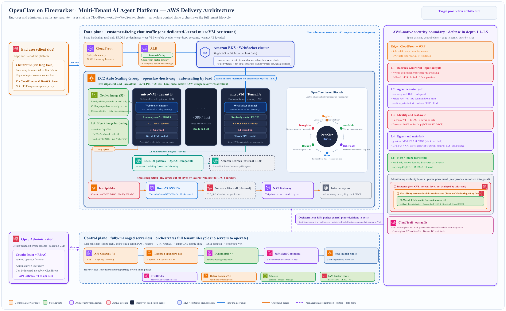

<h1 align="center">🦞 ClawPool</h1>

<p align="center">
  <b>Launch your own branded, hyperscale pool of AI agents on AWS — one tenant, one independent kernel, isolated by Firecracker microVMs</b><br/>
  <i>Run thousands of per-user agents under your brand · L1–L5 defense in depth · Native KVM on Graviton metal · 380 microVMs/host · One-click CDK deploy</i>
</p>

<p align="center">
  <a href="https://github.com/aws-samples/sample-multi-tenant-openclaw-on-firecracker/blob/main/LICENSE">
    
  </a>
  <a href="https://github.com/aws-samples/sample-multi-tenant-openclaw-on-firecracker/releases/latest">
    
  </a>
  <a href="https://github.com/aws-samples/sample-multi-tenant-openclaw-on-firecracker/stargazers">
    
  </a>
  <a href="https://github.com/aws-samples/sample-multi-tenant-openclaw-on-firecracker/network/members">
    
  </a>
  <a href="https://github.com/aws-samples/sample-multi-tenant-openclaw-on-firecracker/issues">
    
  </a>
  
</p>

<p align="center">
  
  
  
  
  
  
  
  
</p>

<p align="center">
  <b>📖 Read in:</b>
  <a href="README.md">English</a> ·
  <a href="docs/README-CN.md">中文</a>
</p>

> ⚠️ **Disclaimer**: This sample is for demonstration purposes only and is not intended for production use. Deploy at your own risk.
>
> 💡 **Note**: The production baseline runs Firecracker on **native KVM** on Graviton4 **bare-metal** (`r8g.metal-24xl`, 96 vCPU / 768 GB) — single-layer virtualization, no nesting penalty. A dev/test profile can run on smaller Graviton (`m8g.xlarge`) or on Intel instance families (`c8i / m8i / r8i`) via [nested virtualization](https://docs.aws.amazon.com/AWSEC2/latest/UserGuide/nested-virtualization.html), which is ~40× slower and **not** for production.
>
> 🧭 **Data-plane model**: a two-tier route — `CloudFront → ALB → OpenResty edge ASG → host DNAT → microVM gateway` — with a per-tenant, KMS-envelope-encrypted token as the sole end-to-end credential. The browser reaches the agent only through the platform back end; it never holds a key. See the two-tier data-plane chapter of the [implementation guide](docs/aws-guide-en/) for the full walkthrough.

---

## 📑 Table of Contents

- [🎯 What is ClawPool?](#-what-is-clawpool)
- [✨ Why ClawPool?](#-why-clawpool)
- [🏗️ Architecture](#%EF%B8%8F-architecture)
- [🛡 L1–L5 Defense in Depth](#-l1l5-defense-in-depth)
- [🎯 Features](#-features)
- [🚀 Quick Start](#-quick-start)
- [🖥️ Web Console](#%EF%B8%8F-web-console)
- [⚙️ Configuration](#%EF%B8%8F-configuration)
- [📚 API Reference](#-api-reference)
- [🌐 Advanced Topics](#-advanced-topics)
- [⬆️ Upgrade Guide](#%EF%B8%8F-upgrade-guide)
- [🤝 Contributing](#-contributing)

---

## 🎯 What is ClawPool?

**ClawPool is the pool — a control plane + isolation fabric for running thousands of per-user AI agents under your own brand.** Each end user gets their own agent in a dedicated Firecracker microVM (independent kernel), and the pool handles the full lifecycle: provision, schedule across a metal fleet, route traffic, fail over, monitor, bill, and tear down — at hyperscale.

The pool is **agent-agnostic**. What an agent _is_ — its persona, its skills, its config — ships as a **replaceable sample image** under [`samples/`](samples/). This repo includes one worked sample, [`samples/finance-agent/`](samples/finance-agent/) (a minimal finance-advisor skeleton), to show the full shape end to end. To launch your own brand, copy it to `samples/<your-brand>/`, swap in your persona + skills + config, and point the build at it (`SAMPLE=<your-brand> ./build-rootfs.sh`). The pool, the isolation, the security layers, and the ops tooling stay exactly the same — only the sample changes.

```
ClawPool (this repo)
├── the pool          ← control plane, scheduler, edge ASG, HA, observability (your platform)
├── security layers   ← L1–L5 guardrails baked into every image            (always-on)
└── samples/          ← replaceable agent images                           (your brand)
    └── finance-agent ← the worked example; copy it to build your own
```

> **Build your own branded pool, not a one-off agent.** The hard part — isolating thousands of untrusted agents on shared metal without one tenant reaching another — is what ClawPool gives you. The agent is yours to define.

---

## ✨ Why ClawPool?

<table>
<tr>
<td width="50%" valign="top">

**🔒 VM-level isolation by design**
Each tenant runs in its own Firecracker microVM — lightweight KVM-based virtualization. Independent kernel, **read-only ext4 golden image** (Firecracker `is_read_only:true` virtio write-barrier — root inside the guest can't modify it) + per-VM overlay, `cap-drop CapEff=0`, seccomp, hidepid, KMS-encrypted EBS, and **cross-tenant `FORWARD DROP` (100% packet loss, measured)**. The blast radius of any compromise stops at one VM — not Linux namespaces sharing one kernel.

**🛡 Real, battle-tested AZ failover**
Default 2-host multi-AZ deployment + automatic AZ failover. Verified end-to-end on real AWS — multi-tenant simultaneous failover with 2/2 dashboards back to HTTP 200 in ~90s. Six deep race conditions hunted down and locked in by unit tests.

**🤖 Bedrock AgentCore native**
One toggle and every microVM auto-connects to AgentCore Gateway, Memory, Code Interpreter, Browser, and Workload Identity. Among the few AWS Samples that fully wire all five AgentCore components.

</td>
<td width="50%" valign="top">

**📊 Full-stack observability, zero static creds**
Amazon Managed Prometheus + Grafana out of the box. ADOT collector auto-signs SigV4 from each host. Six per-VM gauges (`openclaw_vm_cpu_pct`, `memory_used_mb`, `disk_used_pct`, …) + audit log + console PromQL examples.

**⚡ High density at low cost**
**380 microVMs on a single `r8g.metal-24xl`** (768 GB ÷ 2 GB/VM) — boot ready in **1.74s**, register→available in **~4.0s**. CPU overcommit + Firecracker balloon free-page-reporting; 80% Savings Plan + 20% Spot lands at **~$8.36/tenant/month**. Per-tenant quotas guard against noisy neighbors.

**🚀 One-command CDK deploy**
`./setup.sh <region> <profile>` brings up the full stack in 5 minutes — self-managed VPC (/20, 3 AZ, 3 NAT GW), host ASG, OpenResty edge ASG, ALB (idle 3600 s), ElastiCache Multi-AZ Redis, API Lambda, DynamoDB tables (tenant records + short-TTL secret store), a customer-managed KMS key, and AgentCore, all wired and ready. Cloud rootfs build means **no local Linux required** (works from macOS / Windows).

> 📘 **需要在专用 Linux 部署机(Amazon Linux 2023)上做可复现全量部署** —— 权限(IAM instance role)、网络(VPC/子网/SG)、`config.yml`、工具链(docker/node/cdk/python)前置条件与逐步命令 + 真实踩坑清单,见 **[DEPLOYMENT.md](./DEPLOYMENT.md)**。本地跑 CDK Docker bundling 受阻(公司网/磁盘)时走这条路。

</td>
</tr>
</table>

---

## 🏗️ Architecture

### Identity model

End users sign in through your own platform's identity provider. The platform back end mints a short-lived, platform-signed token per session; the pool never sees end-user credentials and never trusts a client's self-reported identity. Every authorization decision — which user may reach which tenant — is made server-side against an ownership ledger held by the control plane.

### Delivery-level architecture

<p align="center">
  
</p>
<p align="center"><i>Separate end-user and admin entry paths, a serverless control plane orchestrating the full tenant lifecycle, and L1–L5 defense in depth. See the <a href="docs/aws-guide-en/">implementation guide</a> for the annotated walkthrough.</i></p>

### Data plane: two-tier route with token-only auth

The single most important design choice in the pool is **how the browser reaches a tenant's agent**. ClawPool runs a **two-tier route** through an OpenResty edge fleet that looks up each tenant in Redis and forwards through the host's iptables DNAT into the microVM's gateway. There is one credential end-to-end: a per-tenant, KMS-envelope-encrypted gateway token that the platform back end holds and never exposes to the browser.

```
Browser  ─ wss ─▶  Platform back end  ─ HTTP+SSE, bearer token ─▶
   CloudFront (origin read-timeout capped by AWS)
     ─▶ ALB (long idle timeout, SG allowlists the CloudFront prefix list only)
       ─▶ OpenResty edge ASG (3 AZ, min 3, ELB health, warmup gate)
         ─ Redis route lookup per tenant (L1 worker cache / L2 shared dict / L3 ElastiCache Multi-AZ)
           ─▶ Host iptables PREROUTING DNAT (one port per microVM)
             ─▶ microVM gateway  ── token-only, control UI disabled
```

Design intent, in one line each:

- **🔒 Security** — one credential, one auth mode. The gateway trusts a bearer token and nothing else; the interactive control UI is disabled. The token is minted from KMS random bytes, envelope-encrypted bound to the tenant, stored ciphertext-only in a short-TTL table, and cold-injected before the VM starts, so plaintext never touches parameter store, audit logs, or Lambda logs. The API Lambda cannot decrypt it; only the platform back end decrypts, in its own process, with the matching encryption context.
- **⚡ Performance** — routing is an in-memory hash on the edge. A per-worker cache covers steady state; a shared dictionary survives a brief Redis outage via fail-static; ElastiCache Multi-AZ is the source of truth. Streaming replies flow as SSE end-to-end from the microVM. Because CloudFront caps origin read time, **clients ping periodically** to keep an idle stream alive.
- **🛠 Operations** — no per-tenant identity provider client to manage. Failover reduces to primary-endpoint DNS re-resolution plus edge fail-static. Each host advertises its own address into Redis via a strict port bitmap, so the edge routes to the right box even when a tenant moves.
- **🧰 Maintainability** — customer SSO that cannot do headless login stays out of the data path. External SSO federates into the platform's own identity provider, transparent to the pool.

> **Full walkthrough** — see the two-tier data-plane chapter of the [implementation guide](docs/aws-guide-en/).

### Full topology (ASCII)

<details>
<summary><b>ASCII version (for AI/text access)</b></summary>

```
DATA PLANE — consumer chat traffic (one independent-kernel microVM per tenant)
  End user (in your app / browser)
     │  long-lived wss to the platform back end (platform-signed session token)
     ▼
  Platform back end  ── reveals + decrypts the per-tenant token, relays HTTP+SSE upstream
     ▼
  CloudFront  (sole public ingress · origin read-timeout capped by AWS · periodic client heartbeat)
     ▼
  ALB  (internet-facing · long idle timeout · SG allowlists the CloudFront prefix list only)
     ▼
  OpenResty edge ASG  ── L1 worker cache / L2 shared dict / L3 Redis route lookup, fail-static
     │  edge balancer picks the right host, or the local guest for a same-host tenant
     ▼
  EC2 metal host ASG  ── iptables PREROUTING DNAT (one port per microVM)
     host = Graviton bare-metal (96 vCPU / 768 GB · native KVM) · 380 microVMs/host
        ├── microVM tenant-A  (read-only ext4 golden image + overlay · 2 GB · cap-drop · L1 Guardrail · L2 sentinel · host-side auditd · zero AWS creds)
        │       OpenClaw gateway  ── token-only, control UI disabled
        ├── microVM tenant-B  ...
        └── × 380
              │  LLM inference (agent → model)
              ▼
        LiteLLM gateway (per-tenant key metering/quota) ──→ Amazon Bedrock (PrivateLink, no public egress)

ROUTE AUTHORITY — ElastiCache Redis (Multi-AZ, automatic failover)
  Per-tenant route record: which host, which port, which guest address
  Writer: host agent (writes the DDB descriptor + Redis on VM promotion)
  Reader: OpenResty edge (three-tier cache with fail-static)

  EGRESS REVIEW (every outbound hop inspected; host originates, layered to the VPC edge):
     host iptables (cross-tenant + IMDS DROP · MASQUERADE)
       → Route 53 DNS Firewall (threat list → NXDOMAIN, config-gated)
       → [planned] AWS Network Firewall (TLS SNI allowlist) — not yet deployed
       → NAT Gateway → internet (allowlist only, else reject)

CONTROL PLANE — fully-managed serverless (no ops servers)
  Admin → create-tenant API → API Gateway (API key)
        → API Lambda (API key + optional role-based access control)
        → DynamoDB (tenant / host / group / audit · atomic slot allocation)
        → command channel → host
        → host lifecycle script (start/stop/rebuild microVM — the host executes, never hot-patches a live VM)
  Side-cars (scheduling/support, off the main path):
     EventBridge (health/scaler/backup cron) · helper Lambdas · S3 (console/image/backup) · least-privilege IAM
```

</details>

> **Deep dive:** for the full architecture and security design — the trust model, the L1–L5 defense-in-depth detail, the two-tier data-plane route, and the **known limitations** — see the AWS-style implementation guide under [`docs/aws-guide-en/`](docs/aws-guide-en/).

### Network Model

Each VM gets a dedicated **/30 point-to-point link** to the host via a TAP device — all inside `172.16.0.0/16`, so a single east-west `FORWARD DROP` over the `/16` covers every VM (this replaced the old per-VM `/24`, which capped a host at 254 VMs):

```
VM1: tap-vm1  host=172.16.0.1/30  guest=172.16.0.2/30
VM2: tap-vm2  host=172.16.0.5/30  guest=172.16.0.6/30
VMn: tap-vmN  host=172.16.x.(4n-3)/30  guest=172.16.x.(4n-2)/30
```

- **Outbound**: host iptables MASQUERADE → DNS FW → NAT → internet (allowlist only). _(A TLS_SNI-allowlisting AWS Network Firewall hop is planned but not yet deployed.)_
- **Inbound**: Browser → platform back end → CloudFront → ALB → OpenResty edge → host DNAT → microVM gateway (token-only). The edge looks up each tenant's route in Redis; the browser holds no key and reaches the agent only through the platform back end. Admin REST goes via API Gateway.
- **Inter-VM**: `FORWARD DROP` across the whole `/16` — 100% packet loss, measured. IMDS `169.254.169.254` also `FORWARD DROP`ed (anti credential-theft).

### Project Structure

The tree maps directly onto the three layers — **the pool** (`deploy/`, `console/`, `setup.sh`), **the security layers** (baked by `build-rootfs.sh` from a sample's `plugins/`), and **replaceable agent images** (`samples/`):

```
sample-multi-tenant-openclaw-on-firecracker/
│
│  ── THE POOL (your platform — agent-agnostic) ──
├── deploy/                    # CDK project + control plane
│   ├── app.py                 # CDK app entry
│   ├── stack.py               # Infrastructure definition
│   ├── lambda/
│   │   ├── api/handler.py             # Tenant CRUD + host management + self-service
│   │   ├── templates/handler.py       # Config template CRUD
│   │   ├── skills/handler.py          # Shared skills list
│   │   ├── health_check/handler.py    # Scheduled health + AZ failover
│   │   ├── agentcore_tools/handler.py # AgentCore Gateway Lambda tools
│   │   └── scaler/handler.py          # Idle host reclamation
│   ├── userdata/
│   │   ├── init-host.sh       # Host init (platform params, images, nginx, host-agent)
│   │   ├── host-agent.py      # VM health polling + DDB writes + balloon
│   │   ├── launch-vm.sh       # microVM launch (cold-inject persona/skills → read-only ext4 golden image + overlay)
│   │   ├── route_ops.py       # Port bitmap + iptables DNAT + Redis route writes
│   │   └── stop-vm.sh         # microVM stop
│   └── edge/                  # OpenResty edge data plane (nginx/Lua + install-edge.sh, opt-in)
├── console/                   # Web management console
├── setup.sh                   # One-click deploy + .env.deploy export
├── build-rootfs.sh            # Golden-image build — bakes SAMPLE into a read-only ext4 image
│
│  ── REPLACEABLE AGENT IMAGES — one image = one use case (your brand) ──
├── samples/
│   └── finance-agent/              # The worked example. Copy to samples/<your-brand>/ to make your own.
│       ├── persona/    #   who the agent is (SOUL / IDENTITY / AGENTS / USER / …)
│       ├── config/     #   per-deployment config + secrets (private; .example tracked)
│       ├── skills/     #   agent capabilities (+ _clis/ the skills call)
│       └── security/   #   security layers baked in (sentinel-guard + acl-guard)
│
│  ── SHARED ──
├── tests/                     # 2400+ tests (unit / e2e / load / live blind-spot)
├── templates/                 # OpenClaw config templates (openclaw.json — model/provider)
├── docs/                      # Delivery docs (CN): access / ops / arch-security
├── scripts/                   # build-rootfs-on-ec2.sh, destroy.sh, oc-connect.sh, …
├── pyproject.toml · cdk.json · config.yml.example
```

---

## 🛡 L1–L5 Defense in Depth

> The core of consumer-facing AI agent security is **not** restricting one user's freedom — it's **controlling the blast radius**. Containers do this with `cap-drop`/seccomp/namespaces; we go one layer stronger with Firecracker microVMs (independent kernel) and stack five enforcement layers on top. **Every layer lands in code or in a device — none of them trust the model to police itself.**

| Layer                                        | Scope                                                                                | Enforcement (code / device, not model self-discipline)                                                                                                                                                                                                                                                                                                                                                                                                                                                                                                                                                                              |
| -------------------------------------------- | ------------------------------------------------------------------------------------ | ----------------------------------------------------------------------------------------------------------------------------------------------------------------------------------------------------------------------------------------------------------------------------------------------------------------------------------------------------------------------------------------------------------------------------------------------------------------------------------------------------------------------------------------------------------------------------------------------------------------------------------- |
| **L1 · Prompt**                              | Two gates around the model: input intercepts intent, output intercepts leaks         | LiteLLM pre/post hooks + **Bedrock `ApplyGuardrail` (input + output)**, decoupled from the base model. Jailbreak **14/14 blocked, 0 false positives** (measured).                                                                                                                                                                                                                                                                                                                                                                                                                                                                   |
| **L2 · Tool**                                | Hard-deny tool execution before it runs (default-deny)                               | `before_tool_call` ACL — path/command denylist; reading `.env`/IMDS/credential paths is **vetoed before execution**. `sentinel-guard` 41/41, `acl-guard` 8/8 unit tests.                                                                                                                                                                                                                                                                                                                                                                                                                                                            |
| **L3 · Identity**                            | Control-plane identity gate + east-west hard isolation                               | Data plane: OpenClaw-native Ed25519 device auth (server-held key, pubkey cold-injected). Control plane: x-api-key + optional Cognito RBAC → `owner_id` gate (code `if`). Cross-tenant `iptables FORWARD DROP` — **100% packet loss, kernel-level hard cut**.                                                                                                                                                                                                                                                                                                                                                                        |
| **L4 · Network**                             | Block credential theft + control egress destinations                                 | IMDS `169.254.169.254` `FORWARD DROP` (anti credential-theft) · Route53 DNS Firewall (threat list → NXDOMAIN, config-gated) · host `iptables` NAT egress allowlist, else REJECT. _(AWS Network Firewall TLS_SNI allowlist is planned, not yet deployed — no `stack.py` reference today.)_                                                                                                                                                                                                                                                                                                                                           |
| **L5 · Credential · Read-only · Monitoring** | Credentials never reach the model + guardrails are immutable + full-stack monitoring | Zero long-lived AWS creds in the guest; secrets live in tool files, not the conversation; **read-only ext4 golden image (Firecracker `is_read_only:true` virtio write-barrier — root inside the guest can't modify it)**; in-guest runtime monitoring via Wazuh FIM/auditd (measured). Account-level GuardDuty (VPC/DNS/EC2/S3 findings, config-gated) — its `RUNTIME_MONITORING` is disabled by default, so in-guest runtime is Wazuh/auditd, not the GuardDuty Runtime agent. CloudTrail Object Lock (COMPLIANCE WORM) applies to the tenant backup bucket; Inspector (host CVE) is account-level and not deployed by this stack. |

**Why it holds (red-team takeaway):** everything that _can_ be bypassed is the part that "asks the model to judge intent"; everything that _holds_ is the deterministic code/device layer — which is exactly why this design pushes control down to code.

---

## 🎯 Features

> Everything that ships out of the box. Nine categories, each independently toggleable in `config.yml`.

<details open>
<summary><b>🔒 VM-level Isolation</b> — Firecracker microVM, independent kernel, read-only ext4 golden image, cap-drop, FORWARD DROP</summary>

| Capability                         | Detail                                                                                                                                                                                                                                                                                                                                             |
| ---------------------------------- | -------------------------------------------------------------------------------------------------------------------------------------------------------------------------------------------------------------------------------------------------------------------------------------------------------------------------------------------------- |
| **Firecracker microVM**            | Each tenant in its own lightweight KVM-based microVM. Boot **1.74s** measured; register→available ~4.0s.                                                                                                                                                                                                                                           |
| **Independent kernel**             | Per-tenant Linux kernel — kernel panics don't leak across tenants.                                                                                                                                                                                                                                                                                 |
| **Read-only ext4 golden image**    | Identity/skills/guardrails cold-baked into a read-only ext4 disk — read-only enforced by the Firecracker `is_read_only:true` virtio write-barrier (plus guest `mount -o ro` + ro-bind), not the filesystem type — with a per-VM writable overlay. Root inside the guest **cannot modify** the base — change identity only by rebuilding the image. |
| **cap-drop + seccomp + hidepid**   | `cap-drop CapEff=0`, seccomp filter, hidepid — guest runs deprivileged.                                                                                                                                                                                                                                                                            |
| **EBS encryption at rest**         | KMS-encrypted by default for both rootfs and data volumes.                                                                                                                                                                                                                                                                                         |
| **Dedicated /30 link per VM**      | One `/30` point-to-point tap link per VM, all inside `172.16.0.0/16`.                                                                                                                                                                                                                                                                              |
| **iptables FORWARD DROP**          | Cross-tenant routing **DROP**ed across the whole `/16` (**100% packet loss, measured**); IMDS `169.254.169.254` also DROPed (anti credential-theft).                                                                                                                                                                                               |
| **PID namespace + zero AWS creds** | Host can't see guest processes; guests can't see each other; no long-lived AWS credentials in the guest.                                                                                                                                                                                                                                           |

</details>

<details open>
<summary><b>🛡 High Availability — Multi-AZ + Automatic AZ Failover</b> (v1.3.x flagship)</summary>

| Capability                   | Detail                                                                                                   |
| ---------------------------- | -------------------------------------------------------------------------------------------------------- |
| **Default 2-host Multi-AZ**  | `min_capacity: 2` + `multi_az.enabled: true` are defaults — HA is opt-out, not opt-in.                   |
| **Automatic AZ failover**    | Lambda detects AZ outages every 5 min, migrates affected tenants to a healthy AZ.                        |
| **30-min cooldown**          | Per-AZ debounce against flapping outages.                                                                |
| **ALB rule auto-tracking**   | Tenant migration auto-updates ALB listener rules — Dashboard URL never changes.                          |
| **Backup-required policy**   | Path A: tenant has no backup → refuse to migrate + SNS alert (data safety > availability).               |
| **Concurrent Lambda safety** | `reserved_concurrent_executions=1` + DDB ConditionalCheck → no race conditions.                          |
| **SSM-vs-VM verify probe**   | Cross-checks `pgrep firecracker` + nginx conf — distinguishes "real failure" from "misleading SSM exit". |
| **Audit log**                | Every failover event — `AZ_OUTAGE_DETECTED`, `AZ_FAILOVER_RECOVERED_BY_VERIFY`, etc.                     |

> **Real-environment proof (v1.3.2)**: 2 tenants on the failed AZ, both back to `status=running` + Dashboard HTTP 200 in ~90s. `tenants_failed_over: 2, tenants_failed: 0, tenants_blocked: 0`.

</details>

<details>
<summary><b>🔧 Complete Tenant Lifecycle</b> — 12 first-class operations, all available via API + Console</summary>

| Operation                 | API                                      | What it does                                                          |
| ------------------------- | ---------------------------------------- | --------------------------------------------------------------------- |
| **Create / Delete**       | `POST /tenants` / `DELETE /tenants/{id}` | Spawn / remove a tenant. `?keep_data=true` preserves the data volume. |
| **Restart / Reset**       | `/restart` / `/reset`                    | Restart VM (fast); reset reinstalls rootfs but preserves data.        |
| **Stop / Start**          | `/stop` / `/start`                       | Offline but keep disks.                                               |
| **Pause / Resume**        | `/pause` / `/resume`                     | Firecracker-native vCPU freeze (instant).                             |
| **Backup**                | `/backup`                                | Manual snapshot of data volume to S3.                                 |
| **Hot-resize vCPU**       | `/resize`                                | Add vCPU online without restart.                                      |
| **Resize disk**           | `/resize-disk`                           | Grow the data volume; `resize2fs` runs automatically.                 |
| **Live migrate**          | `/migrate`                               | Snapshot/restore to another host — Dashboard URL unchanged.           |
| **Clone**                 | `clone_from` on create                   | Same-host `cp` of the data volume — much faster than backup-restore.  |
| **Restore**               | `restore_from` on create                 | Restore from any backup (orphan or active).                           |
| **Tags + TTL + schedule** | Body fields on create                    | Tag-based filter, auto-stop on TTL, office-hours schedule.            |
| **Batch operations**      | `POST /batch/tenants`                    | `stop` / `start` / `delete` / `backup` by ID list or tag filter.      |

</details>

<details>
<summary><b>⚡ Resource Elasticity</b> — ASG, overcommit, Spot, quotas, Graviton</summary>

| Capability            | Detail                                                                                    |
| --------------------- | ----------------------------------------------------------------------------------------- |
| **ASG auto-scale**    | New EC2 host on demand; idle hosts reclaimed after two-round confirmation.                |
| **CPU overcommit**    | `cpu_overcommit_ratio: 2.0` → 8 physical vCPU = 16 allocatable.                           |
| **Memory overcommit** | `mem_overcommit_ratio: 1.5` + Firecracker balloon → 32 GiB physical = 48 GiB allocatable. |
| **Spot instances**    | `asg.use_spot: true` saves 60–70%. ASG auto-replaces preempted hosts.                     |
| **Per-tenant quotas** | `QUOTAS_MAX_VCPU/MEM/DATA_DISK_MB` blocks oversized tenants at create-time.               |
| **Graviton (ARM64)**  | `instance_type: r8g.2xlarge` ✅ — rootfs builds for both arches.                          |

</details>

<details>
<summary><b>📊 Observability</b> — Two-tier health + Prometheus + Grafana, zero static credentials</summary>

| Capability                    | Detail                                                                                                                                             |
| ----------------------------- | -------------------------------------------------------------------------------------------------------------------------------------------------- |
| **host-agent (5s)**           | Per-host systemd service polling all VMs and writing live metrics to DynamoDB.                                                                     |
| **Lambda watchdog (5min)**    | Cross-fleet sweep, AZ-outage detection, failover orchestration.                                                                                    |
| **Amazon Managed Prometheus** | Fully-managed AMP workspace with PromQL compatibility.                                                                                             |
| **Amazon Managed Grafana**    | IAM Identity Center login + AMP datasource + sample dashboards.                                                                                    |
| **ADOT collector**            | Auto SigV4-signed remote-write — no static credentials anywhere.                                                                                   |
| **6 per-VM gauges**           | `openclaw_vm_health`, `cpu_pct`, `memory_used_mb`, `memory_balloon_mib`, `disk_used_mb`, `disk_used_pct` — all labeled by `tenant` and `instance`. |
| **Audit log**                 | Every mutating API call → DynamoDB with 90-day TTL; queryable via `GET /audit-log`.                                                                |

</details>

<details>
<summary><b>🤖 Bedrock AgentCore Integration</b> — Optional one-toggle, full 5-component wire-up</summary>

| Component             | Role                                                                                                                   |
| --------------------- | ---------------------------------------------------------------------------------------------------------------------- |
| **Gateway**           | MCP tool hub — Lambda functions exposed as MCP tools. Three demo tools: `hello`, `system_info`, `timestamp`.           |
| **Memory**            | Multi-turn conversation context. `create_event` / `list_events` / `batch_create_memory_records`. Per-tenant isolation. |
| **Code Interpreter**  | Python 3.12 sandbox. `start_session` → `executeCode` → `stop_session`.                                                 |
| **Browser**           | Remote Chromium with WebSocket stream. Automation-ready.                                                               |
| **Workload Identity** | Each VM auto-injected with temporary credentials at boot — no static keys, auto-refresh.                               |

> Among the few AWS Samples projects that wire **all five AgentCore components** end-to-end and verify them with E2E tests.

</details>

<details>
<summary><b>💾 Backup & Restore</b> — Scheduled, manual, cross-tenant, orphan-safe</summary>

| Capability                | Detail                                                                           |
| ------------------------- | -------------------------------------------------------------------------------- |
| **Scheduled backups**     | EventBridge cron — every running tenant's data volume → S3 daily.                |
| **Manual trigger**        | `POST /tenants/{id}/backup` — async, returns 202.                                |
| **Orphan-safe restore**   | Source tenant can be deleted; backup remains restorable into a new tenant.       |
| **S3 lifecycle**          | `backup_retention_days` controls automatic cleanup (default 7 days).             |
| **Trap-safe**             | VM auto-resumes even if compress/upload fails — no stuck `paused` state.         |
| **Pause-compress-resume** | Atomic: pause → pigz compress → upload → resume — sub-second guest interruption. |

</details>

<details>
<summary><b>🔐 Security & Compliance</b> — Defense in depth, 7 independent layers</summary>

| Layer                      | Implementation                                                                                                                                                                                                                                                                                                                                                                                                                                     |
| -------------------------- | -------------------------------------------------------------------------------------------------------------------------------------------------------------------------------------------------------------------------------------------------------------------------------------------------------------------------------------------------------------------------------------------------------------------------------------------------- |
| **Encryption at rest**     | EBS volumes (rootfs + data) KMS-encrypted by default.                                                                                                                                                                                                                                                                                                                                                                                              |
| **Encryption in transit**  | Browser → platform back end → CloudFront → ALB → OpenResty edge → microVM gateway, TLS end-to-end. The edge routes by an in-memory Redis lookup; the microVM gateway trusts only a per-tenant bearer token that the platform back end holds. The browser never sees any gateway secret.                                                                                                                                                            |
| **API authentication**     | API Gateway with `x-api-key` + optional AWS WAF (rate limit, geo block, OWASP).                                                                                                                                                                                                                                                                                                                                                                    |
| **Console authentication** | Cognito OAuth2 implicit flow + optional MFA.                                                                                                                                                                                                                                                                                                                                                                                                       |
| **RBAC**                   | Cognito Groups: `admin` / `operator` / `viewer`. Opt-in via `console_auth.rbac_enabled` (default off, independent of login — 1.5.4). When enabled, the id_token's **RS256 signature is verified** against the pool JWKS before any claim is trusted (1.5.0); a forged / `alg:none` / expired token is downgraded to `viewer`, and a request with no Bearer token fail-safes to `viewer` so writes 403 unless a genuine Cognito token is presented. |
| **microVM SSH**            | **Pubkey-only** (1.5.0). Each host self-generates an `ed25519` keypair at boot; the public key is injected per-VM at launch (one key per host). Root login and password auth are disabled in the rootfs and both accounts are locked — no shared password anywhere.                                                                                                                                                                                |
| **Audit log**              | All `POST` / `PUT` / `DELETE` operations recorded with 90-day TTL.                                                                                                                                                                                                                                                                                                                                                                                 |
| **Network isolation**      | iptables `FORWARD DROP` between tenant subnets _and_ to the host IMDS (`169.254.169.254`) — cross-tenant and credential-theft paths explicitly disabled.                                                                                                                                                                                                                                                                                           |

</details>

<details>
<summary><b>🚀 Easy Deployment</b> — One-command CDK + cloud-native rootfs build</summary>

| Capability                           | Detail                                                                                                                               |
| ------------------------------------ | ------------------------------------------------------------------------------------------------------------------------------------ |
| **One-command setup**                | `./setup.sh <region> <profile>` — full CDK stack in ~5 min.                                                                          |
| **Cloud rootfs build**               | `./scripts/build-rootfs-on-ec2.sh` — spins up a one-shot EC2 host + SSM, no local Linux.                                             |
| **Custom domain**                    | `./setup.sh --domain claw.example.com --cert <acm-arn>` — ACM in `us-east-1`.                                                        |
| **Cognito + RBAC**                   | Optional auth; signature-verified id_tokens map `admin` / `operator` / `viewer` groups, fail-safe to `viewer` with no token (1.5.0). |
| **Manifest-based rootfs versioning** | `manifest.json` tracks rootfs versions; per-host registry.                                                                           |
| **Terraform parity**                 | Terraform module mirrors the CDK stack for teams already on Terraform.                                                               |

</details>

---

## 🚀 Quick Start

> **Prerequisites**: AWS account + CLI configured · CDK CLI · Python 3.12+ · [uv](https://docs.astral.sh/uv/) package manager

```bash
# 1️⃣ Clone & configure
git clone https://github.com/aws-samples/sample-multi-tenant-openclaw-on-firecracker
cd sample-multi-tenant-openclaw-on-firecracker
cp config.yml.example config.yml                                  # tweak as needed
cp templates/openclaw.json.example templates/openclaw.json        # provider/model

# 2️⃣ One-click deploy — that's it.
#     `cdk deploy` (inside setup.sh) now does the whole thing in one shot:
#       • provisions VPC, ASG, ALB, Lambda, DynamoDB, CloudFront, Cognito, KMS, WAF
#       • CodeBuild bakes the golden image IN-STACK and the ASG waits for it, so
#         the first host boots with the image already in S3 (no chicken-and-egg)
#       • stands up a LiteLLM gateway automatically (or set ai_gateway.url in
#         config.yml to reuse an existing one)
./setup.sh us-west-2 your-aws-profile

# 3️⃣ Create your first tenant
source .env.deploy
curl -s -X POST "${API_URL}tenants" -H "x-api-key: ${API_KEY}" \
  -d '{"name":"my-first-agent","vcpu":2,"mem_mb":4096}' | jq .
```

> Open the Console URL printed at the end of `setup.sh` to manage tenants from a browser. Every tenant gets a one-click HTTPS dashboard with no custom domain or certificate required.
>
> **Bring your own agent.** The deploy bakes [`samples/finance-agent/`](samples/finance-agent/) by default. To ship your own brand, copy it to `samples/<your-brand>/`, edit the persona / skills / config, and deploy with `SAMPLE=<your-brand>`. The pool, isolation, and security layers stay identical — only the sample changes.
>
> **Re-baking the image out-of-band** (optional): the in-stack CodeBuild path covers first deploy. To rebuild later without a full redeploy, `image.build_in_stack: false` in config.yml then run `./scripts/build-rootfs-on-ec2.sh v1.1` (cloud-native, no local Linux).

---

## 🖥️ Web Console

<p align="center">
  
  <br/>
  <i>Real production deployment — tenants distributed across 2 AZs, live CPU/Memory/Disk metrics, one-click migration & dashboard access.</i>
</p>

Web-based console hosted on CloudFront (`/console/`), Cognito-authenticated. Five tabs covering everything an operator needs.

### Tenants tab — Multi-host, multi-AZ live operations

Hosts grouped by AZ on the left (each card showing CPU / Memory / VM count and overcommit ratios). Tenants table with live vCPU / Memory / Disk progress bars per row, the assigned skill Group, gateway / health LEDs, and per-tenant Migrate button. AgentCore + Shared Skills surfaces collapsed at the top (shown in the screenshot above).

### Agent Config tab — Templates, MCP tools, skills & groups

Config Templates manager + MCP Tools card (auto-populated via AgentCore Gateway, surfacing every Lambda-backed tool registered with the gateway: name, description, input schema) + Shared Skills with per-skill S3 deep-links:


### Monitoring tab — AMP / Grafana / SNS at a glance

Observability page: AMP / Grafana / SNS status, full per-VM Prometheus gauge inventory with types + labels + descriptions, copy-pasteable sample PromQL queries, and AMP `remote_write` / Grafana endpoints:


### Backups tab — Cross-tenant explorer with orphan support

Cross-tenant explorer marking active vs orphan backups (orphan = source tenant deleted, but the backup is still restorable into a fresh tenant). 7-day S3 lifecycle by default:


### Settings tab — Infrastructure status & Fleet by AZ

At-a-glance infrastructure status: API connection, AgentCore Gateway URL, Multi-AZ HA, Prometheus + Grafana, AWS WAF, Cognito + RBAC, SNS lifecycle events, per-tenant quotas, host overcommit ratios, and a live **Fleet by AZ** table showing how hosts and VMs are spread across availability zones:


---

## ⚙️ Configuration

### Config files

| File                      | Purpose                                                                         |
| ------------------------- | ------------------------------------------------------------------------------- |
| `config.yml`              | Infrastructure config — copy from `config.yml.example` and customize            |
| `templates/openclaw.json` | OpenClaw app config (model, API key, provider)                                  |
| `.env.deploy`             | Deploy environment (region, API URL/Key, bucket) — auto-generated by `setup.sh` |

### Key `config.yml` knobs

| Section        | Key                    | Default              | Description                                                                                                                                                  |
| -------------- | ---------------------- | -------------------- | ------------------------------------------------------------------------------------------------------------------------------------------------------------ |
| `host`         | `instance_type`        | `r8g.metal-24xl`     | Production baseline: Graviton4 bare-metal native KVM (96 vCPU / 768 GB, 380 tenants/host). Dev can use `m8g.xlarge`, or Intel `c8i/m8i/r8i` via nested virt. |
| `host`         | `cpu_overcommit_ratio` | `6.0`                | vCPU is the soft dimension (agents are mostly IO/wait-bound); 380÷95≈4×, 6.0 leaves headroom. Memory is the hard limit.                                      |
| `host`         | `mem_overcommit_ratio` | `1.5`                | Memory is the hard cap: 380×2 GB = 760 GB on 768 GB. With balloon reclaim → 1.5 (1129 GB allocatable); without balloon set ~1.0 to avoid OOM.                |
| `vm`           | `default_vcpu`         | `2`                  | Default vCPU per tenant.                                                                                                                                     |
| `vm`           | `default_mem_mb`       | `4096`               | Default memory (MB) per tenant.                                                                                                                              |
| `balloon`      | `enabled`              | `false`              | Firecracker balloon device for memory overcommit.                                                                                                            |
| `asg`          | `min_capacity`         | `2`                  | Minimum host instances (default Multi-AZ).                                                                                                                   |
| `asg`          | `use_spot`             | `false`              | Spot instances (60–70% savings, may be reclaimed).                                                                                                           |
| `multi_az`     | `enabled`              | `true`               | Multi-AZ HA — enables AZ failover.                                                                                                                           |
| `health_check` | `interval_minutes`     | `5`                  | Lambda watchdog interval.                                                                                                                                    |
| `metrics`      | `enabled`              | `false`              | Provision AMP + Grafana + ADOT.                                                                                                                              |
| `agentcore`    | `enabled`              | `false`              | Provision Gateway + Memory + CodeInterpreter + Browser + Identity.                                                                                           |
| `console_auth` | `enabled`              | `false`              | Cognito authentication for Console.                                                                                                                          |
| `console_auth` | `rbac_enabled`         | `false`              | Enforce viewer/operator/admin role checks on writes (independent of login).                                                                                  |
| `backup_cron`  | —                      | `cron(0 19 * * ? *)` | UTC 19:00 daily backups.                                                                                                                                     |

> See [`config.yml.example`](config.yml.example) for the complete reference.

### Tear down

```bash
./scripts/destroy.sh           # Destroy stack, keep S3 + DynamoDB
./scripts/destroy.sh --purge   # Full cleanup including data
```

---

## 📚 API Reference

All requests require the `x-api-key` header.

### Tenants

| Method   | Path                              | Description                                                                                                                                                                                           |
| -------- | --------------------------------- | ----------------------------------------------------------------------------------------------------------------------------------------------------------------------------------------------------- |
| `GET`    | `/tenants`                        | List all tenants. Filter with `?tag=key:value` (repeatable, AND across pairs).                                                                                                                        |
| `POST`   | `/tenants`                        | Create (admin/operator). Body: `{name, vcpu, mem_mb, data_disk_mb, config_template, tags, ttl_hours, on_expiry, schedule, restore_from, clone_from}` — only `name` required.                          |
| `POST`   | `/tenants/self`                   | **Self-service** create — a logged-in user provisions their _own_ node (viewer-level at the RBAC gate; `owner_id` forced to the caller, per-user cap enforced). Rejected when `EXTERNAL_AUTHZ` is on. |
| `GET`    | `/tenants/{id}`                   | Get tenant details.                                                                                                                                                                                   |
| `DELETE` | `/tenants/{id}`                   | Delete (`?keep_data=true` preserves data volume).                                                                                                                                                     |
| `POST`   | `/tenants/{id}/restart`           | Restart VM (reuse disks).                                                                                                                                                                             |
| `POST`   | `/tenants/{id}/stop` · `/start`   | Stop / start.                                                                                                                                                                                         |
| `POST`   | `/tenants/{id}/pause` · `/resume` | Firecracker-native vCPU freeze / resume.                                                                                                                                                              |
| `POST`   | `/tenants/{id}/reset`             | Reinstall rootfs (data preserved).                                                                                                                                                                    |
| `POST`   | `/tenants/{id}/backup`            | Manual data backup.                                                                                                                                                                                   |
| `POST`   | `/tenants/{id}/resize`            | Hot-add vCPU. Body: `{"vcpu":4}`.                                                                                                                                                                     |
| `POST`   | `/tenants/{id}/resize-disk`       | Offline grow data disk. Body: `{"new_size_mb":16384}`.                                                                                                                                                |
| `POST`   | `/tenants/{id}/migrate`           | Live migration. Body: `{"target_host_id":"i-..."}`.                                                                                                                                                   |
| `GET`    | `/tenants/{id}/backups`           | Backups for one tenant.                                                                                                                                                                               |
| `POST`   | `/batch/tenants`                  | Batch op. Body: `{"action":"stop\|start\|delete\|backup", "ids":[...]\|"filter":{"tag":"k:v"}}`.                                                                                                      |

### Backups, Hosts, AgentCore, Audit, Skills, Templates

| Method                   | Path                            | Description                                                                             |
| ------------------------ | ------------------------------- | --------------------------------------------------------------------------------------- |
| `GET`                    | `/backups`                      | List all backups across tenants (marks orphan vs active).                               |
| `GET`                    | `/hosts`                        | List all hosts.                                                                         |
| `POST`                   | `/hosts/refresh-rootfs`         | Push latest rootfs to all hosts.                                                        |
| `GET`                    | `/hosts/rootfs-version`         | Query current rootfs version.                                                           |
| `GET`                    | `/agentcore/status`             | AgentCore enable status + Gateway URL.                                                  |
| `GET`                    | `/agentcore/tools`              | List MCP tools registered with Gateway.                                                 |
| `GET`                    | `/audit-log`                    | Query audit log. `?since=<ISO8601>&limit=<n>` — 90-day TTL.                             |
| `GET`                    | `/skills`                       | List shared skills (S3-managed). `?tenant=<id>` filters to that tenant's effective set. |
| `GET` · `PUT` · `DELETE` | `/skills/{name}`                | CRUD on individual SKILL.md (1.4.1). PUT body: `{"content":"<markdown>"}`.              |
| `GET` · `POST`           | `/groups`                       | List / create skill groups (1.4.0).                                                     |
| `POST`                   | `/groups/{name}/skills`         | Add a skill to a group. Body: `{"skill":"<name>"}`.                                     |
| `DELETE`                 | `/groups/{name}/skills/{skill}` | Remove a skill from a group.                                                            |
| `GET` · `PUT` · `DELETE` | `/templates/{name}`             | CRUD for config templates (`default` is read-only).                                     |
| `GET`                    | `/system/info`                  | Feature flags + config snapshot (region, version, multi_az, metrics, …).                |

---

## 🌐 Advanced Topics

<details>
<summary><b>Auto Backup & Restore — flow + restore from any backup (orphan-safe)</b></summary>

EventBridge schedules daily backups of all running tenant data volumes to S3. Manual trigger also supported.

**Backup flow**: pause VM → `pigz` compress `data.ext4` → resume VM → upload to S3. VM auto-resumes even on failure (trap cleanup).

```bash
source .env.deploy

# Manual backup (async, returns 202)
curl -s -X POST "${API_URL}tenants/{id}/backup" -H "x-api-key: ${API_KEY}" | jq .

# List all backups across tenants (marks orphan vs active)
curl -s "${API_URL}backups" -H "x-api-key: ${API_KEY}" | jq .
```

**Restore from backup** (orphan-safe — source tenant need not exist):

```bash
# Restore from the latest backup of a (possibly deleted) tenant
curl -s -X POST "${API_URL}tenants" -H "x-api-key: ${API_KEY}" -d '{
  "name": "restored-agent",
  "vcpu": 2, "mem_mb": 4096,
  "restore_from": {"tenant_id": "my-agent-ab12"}
}' | jq .

# Restore from a specific backup timestamp
curl -s -X POST "${API_URL}tenants" -H "x-api-key: ${API_KEY}" -d '{
  "name": "restored-agent",
  "restore_from": {"tenant_id": "my-agent-ab12", "timestamp": "20260428-125402"}
}' | jq .
```

</details>

<details>
<summary><b>🔐 Multi-Domain Setup — Security Hardening (v1.3.4+, recommended for production)</b></summary>

**Why split domains?** When `console/*` and `vm/*` share one CloudFront distribution and one domain:

- Cognito session cookie is set on the parent domain → automatically sent to `/vm/*` requests
- A tenant dashboard rendering unescaped user input (XSS) gets full same-origin access to the operator console DOM → can steal admin tokens
- All tenant dashboards share the same blast radius

**Dual-domain mode** creates two independent CloudFront distributions, each with its own ACM cert. Cognito session cookie is physically scoped to `console_domain` and cannot be sent to `app_domain` — browser policy enforces this at the protocol level.

```bash
# Prerequisites:
#   1. Request TWO ACM certs in us-east-1 (one for console_domain, one for app_domain)
#   2. CNAME both domains to their respective CloudFront distributions after deploy

./setup.sh ap-northeast-1 lab \
  --console-domain console.example.com --console-cert arn:aws:acm:us-east-1:xxx:certificate/console-xxx \
  --app-domain     app.example.com     --app-cert     arn:aws:acm:us-east-1:xxx:certificate/app-xxx
```

After deploy, `setup.sh` prints two distinct URLs:

```
→ Console URL:    https://console.example.com/console/index.html  (operator login)
→ Dashboard URL:  https://app.example.com/vm/<tenant-id>/         (per-tenant)
  ✓ Dual-domain mode active — Cognito session physically isolated from tenant dashboards
```

| Property                                | Single-domain (legacy)   | **Dual-domain (recommended)** |
| --------------------------------------- | ------------------------ | ----------------------------- |
| CloudFront distributions                | 1                        | 2                             |
| ACM certificates                        | 1                        | 2                             |
| Cookie scope                            | shared origin            | **console_domain only**       |
| XSS blast radius                        | all dashboards + console | tenant only                   |
| `OC_CONSOLE_BASE` / `OC_DASHBOARD_BASE` | same                     | different                     |

The legacy `--domain` / `--cert` flags still work for dev/sample deployments.

</details>

<details>
<summary><b>Shared Skills — S3 → Host → VM sync chain (with per-tenant / per-group scoping)</b></summary>

All tenants share a unified skill catalog (`SKILL.md` files) with independent memory per tenant.

```bash
# Upload skills to S3 (auto-synced to all hosts, then injected at VM launch)
aws s3 sync ./my-skills/ s3://${ASSETS_BUCKET}/skills/ --profile $PROFILE

# Sync chain:
#   S3 → Host /data/shared-skills/ (cron 5min) → New VMs at launch
```

**1.4.0 (#62) — per-tenant / per-group skill distribution**: by default every VM gets every skill (broadcast, legacy v1.3.x behavior). To restrict which skills a particular tenant receives, pick a Skill Group in the Console's New Tenant form (1.5.5), or call the API directly:

```bash
# 1) Define a group of skills (optional)
curl -s -X POST "${API_URL}groups" -H "x-api-key: ${API_KEY}" -d '{
  "name": "team-sre",
  "skills": ["k8s-debug", "incident-response"],
  "description": "SRE team standard tools"
}'

# 2a) Per-tenant scoping (only this tenant's skills get cp'd at launch)
curl -s -X POST "${API_URL}tenants" -H "x-api-key: ${API_KEY}" -d '{
  "name": "research-agent",
  "vcpu": 2, "mem_mb": 4096,
  "skills": ["web-search", "code-review"]
}'

# 2b) Group-only scoping
curl -s -X POST "${API_URL}tenants" -H "x-api-key: ${API_KEY}" -d '{
  "name": "sre-bot",
  "group": "team-sre"
}'

# 2c) Both — effective set = tenant.skills ∪ group.skills
curl -s -X POST "${API_URL}tenants" -H "x-api-key: ${API_KEY}" -d '{
  "name": "sre-extras",
  "skills": ["pagerduty"],
  "group": "team-sre"
}'

# Inspect what a tenant will actually receive
curl -s "${API_URL}tenants/{id}" -H "x-api-key: ${API_KEY}" | jq .effective_skills
# → ["incident-response", "k8s-debug", "pagerduty"]   (or "*" for broadcast)
```

Existing tenants (no `skills` and no `group`) keep receiving every skill — **fully backward compatible**, no migration required when upgrading from v1.3.x.

</details>

<details>
<summary><b>Custom Domain — bind ACM + CloudFront (legacy single-domain mode)</b></summary>

```bash
# Prerequisites:
#   1. Request an ACM certificate in us-east-1 (required by CloudFront) and complete DNS validation
#   2. CNAME your domain to the CloudFront domain (see DashboardUrl output)

./setup.sh ap-northeast-1 lab \
  --domain claw.example.com \
  --cert   arn:aws:acm:us-east-1:xxx:certificate/xxx

# Or edit config.yml directly under the cloudfront: section.
# To unbind: --domain "" and re-run setup.sh.
```

</details>

<details>
<summary><b>Auto Scaling — scale-out + idle reclamation</b></summary>

**Scale-out** — No available host when creating a tenant → tenant enters `pending` → ASG launches new instance → pending tenants auto-assigned after init.

**Scale-in** — Scaler Lambda checks every 5 minutes:

1. Host with `vm_count=0` exceeding `idle_timeout_minutes` → marked `idle`.
2. Next round confirms still idle and ASG instances > min → terminate.
3. If a tenant is assigned during this window → auto-recover to `active`.

</details>

<details>
<summary><b>Observability (Optional) — AMP + Grafana + sample PromQL</b></summary>

When `metrics.enabled: true` in `config.yml`, the stack provisions an Amazon Managed Prometheus (AMP) workspace and an Amazon Managed Grafana (AMG) workspace. Each host runs an ADOT collector as a sibling systemd service that scrapes `host-agent`'s `/metrics` endpoint every 30 s and SigV4-signs a remote-write to AMP — no static credentials.

Per-VM gauges exposed (with `tenant=<tenant_id>` and `instance=<host_instance_id>` labels):

```
openclaw_vm_memory_used_mb        openclaw_vm_disk_used_mb
openclaw_vm_memory_balloon_mib    openclaw_vm_disk_total_mb
openclaw_vm_health (0|1)          openclaw_vm_disk_used_pct
```

Sample PromQL:

```promql
# Memory used by all running VMs of a tenant
sum by (tenant) (openclaw_vm_memory_used_mb)

# Hosts with at least one unhealthy VM in the last minute
min_over_time(openclaw_vm_health[1m]) == 0
```

Grafana access uses **AWS IAM Identity Center**:

1. After deploy, the `GrafanaWorkspaceUrl` CFN output gives you the workspace URL.
2. In IAM Identity Center, assign yourself (or a group) to that AMG workspace.
3. First login: in Grafana → _Connections → Data sources → Add → Prometheus_, pick the AMP workspace from the dropdown (the AMG service role already has `aps:QueryMetrics` for it).

To disable observability later, set `metrics.enabled: false` and re-run `setup.sh` — AMP and AMG are removed and you stop being billed for samples / active users.

</details>

<details>
<summary><b>Rootfs Management — versioning + refresh</b></summary>

The build script produces two images: rootfs (OS + software) and data template (`/home/agent` pre-configured content). Versions managed via S3 `manifest.json`. Hosts and tenants track their `rootfs_version`.

```bash
# Build and upload (updates manifest.json + refreshes hosts)
./build-rootfs.sh v1.8

# Manually refresh host images
source .env.deploy
curl -s -X POST "${API_URL}hosts/refresh-rootfs" -H "x-api-key: ${API_KEY}" | jq .

# Query current version
curl -s "${API_URL}hosts/rootfs-version" -H "x-api-key: ${API_KEY}" | jq .

# New VMs use the latest version; existing VMs need a reset to update.
```

</details>

---

## ⬆️ Upgrade Guide

Upgrade from any version to latest in one pass — `setup.sh` carries the full control-plane delta in a single deploy. Per-version notes are in [CHANGELOG.md](CHANGELOG.md).

```bash
git pull
git diff HEAD@{1} HEAD -- config.yml.example   # merge any new config keys into your config.yml
./setup.sh <region> <profile>
```

Impact on an existing deployment (any size) — a redeploy never disturbs running hosts or tenants; the trade-off is that boot-path and rootfs fixes don't reach them until you roll them in:

| Action                                     | Running hosts                                                                                                           | Running tenants                           |
| ------------------------------------------ | ----------------------------------------------------------------------------------------------------------------------- | ----------------------------------------- |
| `git pull` + `./setup.sh`                  | Untouched — the ASG has no rolling/replacing UpdatePolicy, so a new Launch Template does **not** replace live instances | Untouched                                 |
| Lambda code update (in `setup.sh`)         | Untouched — Lambdas are control-plane; brief cold-start only                                                            | Untouched                                 |
| New `init-host.sh` / Launch Template       | Untouched until you replace a host — UserData runs only at first boot                                                   | Untouched                                 |
| `POST /hosts/refresh-rootfs`               | New rootfs pushed in place; no replacement                                                                              | Keep current rootfs until each is `reset` |
| Replace a host (to pick up `init-host.sh`) | That host only — others untouched                                                                                       | Drain/migrate its tenants off first       |

**Prerequisites** — Docker is control-plane only:

- `setup.sh` needs **Docker** (CDK bundles the api Lambda's `cryptography` native ext for the ARM64 runtime), since v1.5.0, regardless of RBAC.
- `build-rootfs.sh` needs **Linux** + `debootstrap`/`mkfs.ext4`/`pigz`, no Docker. On macOS use `scripts/build-rootfs-on-ec2.sh`, which builds on a throwaway EC2 instance — local machine needs only AWS creds.

### Roll fixes into existing hosts/tenants

```bash
source .env.deploy
# rootfs — pushed in place to live hosts; existing tenants pick it up on next `reset`
curl -s -X POST "${API_URL}hosts/refresh-rootfs" -H "x-api-key: ${API_KEY}" | jq .
# launch-vm.sh and other host-side scripts — via SSM
aws s3 cp deploy/userdata/launch-vm.sh s3://${ASSETS_BUCKET}/deployment/scripts/launch-vm.sh
aws ssm send-command --document-name AWS-RunShellScript \
    --targets Key=tag:aws:autoscaling:groupName,Values=openclaw-hosts-asg \
    --parameters 'commands=["aws s3 cp s3://'${ASSETS_BUCKET}'/deployment/scripts/launch-vm.sh /home/ubuntu/launch-vm.sh","chmod +x /home/ubuntu/launch-vm.sh"]'
```

`init-host.sh` changes require replacing the host (UserData runs once). One at a time, zero-downtime: drain tenants off → terminate → ASG relaunches from the new Launch Template → wait `InService` → next.

### Breaking changes

Everything else is covered by `git pull && ./setup.sh`.

| Release    | Change                                                                                                                                                                  | Action                                                                                           |
| ---------- | ----------------------------------------------------------------------------------------------------------------------------------------------------------------------- | ------------------------------------------------------------------------------------------------ |
| **v1.5.0** | Cognito id_token RS256 verification; microVM SSH → pubkey-only (shared password removed)                                                                                | Deploy with Docker; rebuild rootfs + roll hosts for SSH (see below)                              |
| **v1.3.4** | Dual-domain mode scopes the Cognito cookie to the console domain ([#61](https://github.com/aws-samples/sample-multi-tenant-openclaw-on-firecracker/issues/61)) — opt-in | If adopting: two us-east-1 ACM certs + `--console-domain/--console-cert/--app-domain/--app-cert` |
| **v1.3.0** | ASG default → 2 hosts / 2 AZs (AZ failover needs a target)                                                                                                              | None, or set `asg.min_capacity: 1` / `multi_az.enabled: false` for single-AZ                     |

**v1.5.0 details.** RBAC role-gating is opt-in (`console_auth.rbac_enabled: false` by default — `x-api-key` reads and writes unchanged, no Bearer needed). With `rbac_enabled: true`, writes require a valid Cognito id_token (`Authorization: Bearer …`); forged / `alg:none` / expired tokens fall back to `DEFAULT_NO_JWT_ROLE` (default `viewer`). The SSH change is data-plane — existing VMs keep the old password until their host is rolled:

```bash
source .env.deploy && ./scripts/build-rootfs-on-ec2.sh <rootfs_version> <arch>   # rootfs content tag (e.g. v1.1), not the product version
```

---

## 🤝 Contributing

Contributions are welcome! Please see [CONTRIBUTING.md](CONTRIBUTING.md) for code conventions, PR guidelines, and the security issue reporting process.

For security concerns, see [CONTRIBUTING.md#security-issue-notifications](CONTRIBUTING.md#security-issue-notifications).

---

## 📄 License

This library is licensed under the **MIT-0 License**. See the [LICENSE](LICENSE) file.

> The MIT-0 License is a "no attribution required" variant of MIT. You may use, modify, and redistribute this code (including commercial use) without any obligation. AWS Sample projects use this license to lower the barrier to adoption.

---

## 🌟 Star History

<a href="https://www.star-history.com/#aws-samples/sample-multi-tenant-openclaw-on-firecracker&Date">
 <picture>
   <source media="(prefers-color-scheme: dark)" srcset="https://api.star-history.com/svg?repos=aws-samples/sample-multi-tenant-openclaw-on-firecracker&type=Date&theme=dark" />
   <source media="(prefers-color-scheme: light)" srcset="https://api.star-history.com/svg?repos=aws-samples/sample-multi-tenant-openclaw-on-firecracker&type=Date" />
   
 </picture>
</a>

---

<p align="center">
  Made with 🦞 by the AWS Samples team · MIT-0 · 2026<br/>
  <a href="https://github.com/aws-samples/sample-multi-tenant-openclaw-on-firecracker/issues">🐛 Report a bug</a> ·
  <a href="https://github.com/aws-samples/sample-multi-tenant-openclaw-on-firecracker/issues">💡 Request a feature</a> ·
  <a href="https://github.com/aws-samples/sample-multi-tenant-openclaw-on-firecracker/discussions">💬 Discussions</a>
</p>
