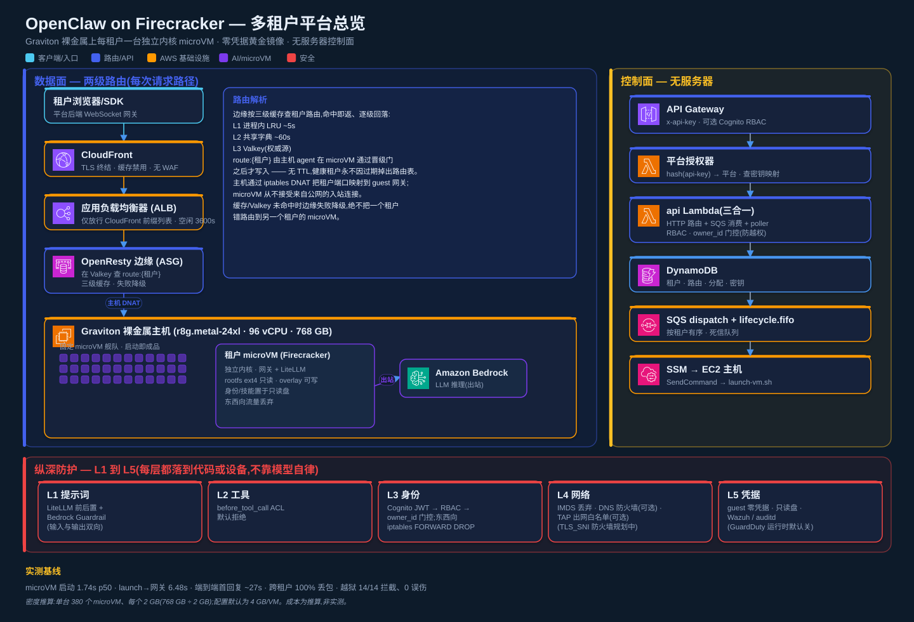
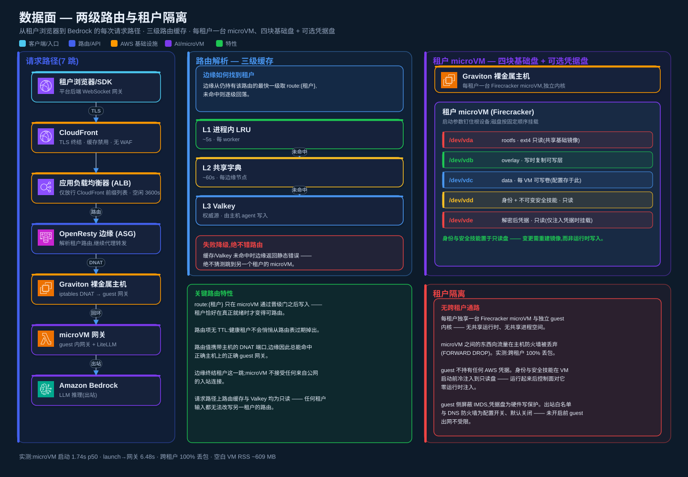
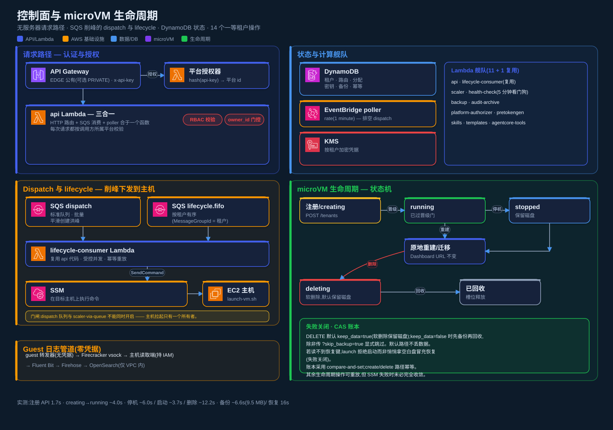

<h1 align="center">🦞 龙虾池 (OpenClaw Pool)</h1>

<p align="center">
  <b>基于 Firecracker microVM 的 AWS 多租户 AI Agent 隔离池</b><br/>
  <i>一租户一台独立内核 microVM · 五层纵深防护 · 全观测 · 一键部署</i>
</p>

<p align="center">
  <a href="https://github.com/aws-samples/sample-multi-tenant-openclaw-on-firecracker/blob/main/LICENSE">
    
  </a>
  <a href="https://github.com/aws-samples/sample-multi-tenant-openclaw-on-firecracker/releases/latest">
    
  </a>
  <a href="https://github.com/aws-samples/sample-multi-tenant-openclaw-on-firecracker/stargazers">
    
  </a>
  <a href="https://github.com/aws-samples/sample-multi-tenant-openclaw-on-firecracker/network/members">
    
  </a>
  <a href="https://github.com/aws-samples/sample-multi-tenant-openclaw-on-firecracker/issues">
    
  </a>
  
</p>

<p align="center">
  
  
  
  
  
  
  
  
</p>

<p align="center">
  <b>📖 阅读语言：</b>
  <a href="../README.md">English</a> ·
  <a href="README-CN.md">中文</a>
</p>

> ⚠️ **声明**: 本项目为示例代码，仅供演示用途，不建议直接用于生产环境。请自行评估部署风险。
>
> 💡 **说明**: 生产基线跑在 **AWS Graviton 裸金属实例 (`r8g.metal-24xl`, arm64)** 上，直接用宿主机原生 KVM 拉起 Firecracker microVM，**不走嵌套虚拟化**。开发/试用可用 `m8g.xlarge` 等小机型。x86 非裸金属实例可开嵌套虚拟化跑通流程，但慢约 40 倍，仅适合开发。

---

## 📑 目录

- [✨ 为什么选择龙虾池？](#-为什么选择龙虾池)
- [🏗️ 架构](#%EF%B8%8F-架构)
- [🎯 功能特性](#-功能特性)
- [🚀 快速开始](#-快速开始)
- [🖥️ Web Console](#%EF%B8%8F-web-console)
- [⚙️ 配置](#%EF%B8%8F-配置)
- [📚 API Reference](#-api-reference)
- [🌐 进阶主题](#-进阶主题)
- [⬆️ 升级指南](#%EF%B8%8F-升级指南)
- [🤝 贡献](#-贡献)

---

## ✨ 为什么选择龙虾池？

<table>
<tr>
<td width="50%" valign="top">

**🔒 VM 级的强隔离**
每个租户跑在自己的 Firecracker microVM 里 — 和 AWS Lambda、Fargate 同一种轻量虚拟化技术。独立 Linux 内核、OverlayFS rootfs、每 VM 一条独占 /30 点对点网络、KMS 加密 EBS。把"越权止于单租户"从容器级提到 VM 级，**不是**多个租户共享一个内核的 namespace 隔离。

**🛡 真实压测过的 AZ failover**
默认 2-host 多 AZ 部署 + 自动 AZ failover，HA 是 opt-out 不是 opt-in。真实 AWS 上端到端验证过 — multi-tenant 同时 failover，双 Dashboard 都在 90 秒内回到 HTTP 200，附 audit log 留痕。

**🤖 五层纵深防护，不靠模型自律**
L1 Prompt（LiteLLM pre/post + Bedrock Guardrail 双向）、L2 工具（`before_tool_call` ACL，default-deny）、L3 身份（数据面 OpenClaw 原生 Ed25519 device 认证 + 控制面 RBAC + 东西向 iptables DROP）、L4 网络（IMDS 封锁 + DNS Firewall + NAT 出网白名单）、L5 凭据·只读·监控（guest 零长期凭据 + 只读黄金镜像盘 + Wazuh/auditd 运行时监控）。每层都落到代码或设备上。

</td>
<td width="50%" valign="top">

**📊 全栈观测，零静态凭证**
开箱即用 Prometheus + Grafana（默认自建 EC2 栈，可选 Amazon Managed Prometheus/Grafana）。每台 host 上 host-agent 5 秒一轮采指标，ADOT collector 自动 SigV4 远程写。6 个 per-VM gauge（`openclaw_vm_cpu_pct`、`memory_used_mb`、`disk_used_pct`…）+ audit log + Console 内置 PromQL 示例。

**⚡ 高密度低成本**
单台 `r8g.metal-24xl`（768 GB / 96 vCPU）按 2 GB/VM 稳态承载 **380 租户/台**（760 GB ÷ 2 GB，容量推算）；单台全健康实测 **187 节点**（磁盘瓶颈，非内存上限）。Spot + Savings Plan 摊薄按需价，成本约 **$8.36/租户/月**（80% SP + 20% Spot，成本推算）。Per-tenant Quota 防 noisy neighbor。

**🚀 一行命令 CDK 部署**
`./setup.sh <region> <profile>` 几分钟拉起完整栈 — VPC、ASG、ALB、Lambda、DynamoDB、CloudFront 全部接通即用（Cognito console 登录、OpenResty 边缘数据面等为 opt-in，按 `config.yml` 开关启用）。栈内 CodeBuild 烤镜像意味着**无需本地 Linux**（macOS / Windows 直接用）。

</td>
</tr>
</table>

---

## 🏗️ 架构

### 交付级架构总览

三张图分别给出平台总览、数据面每次请求路径、控制面与 microVM 生命周期，数据均对齐 `engineering/02-system-constraints/FACT-BASELINE.md` 与当前代码实现。

**平台总览** —— 左侧数据面（终端用户经平台后端 WebSocket 网关 → CloudFront → ALB → OpenResty 边缘 → microVM gateway），中部无服务器控制面（编排租户全生命周期），右侧 L1–L5 纵深防御边界。

<p align="center">
  
</p>

**数据面** —— 从租户浏览器到 Bedrock 的每次请求路径（7 跳），三级路由缓存（L1 进程内 LRU ~5s / L2 共享字典 ~60s / L3 Valkey 权威源、无 TTL、失败降级），以及每租户一台 microVM、四块基础盘 + 可选凭据盘。

<p align="center">
  
</p>

**控制面与生命周期** —— 无服务器请求路径，默认同步 SSM 派发（可选开启 SQS dispatch 队列和 lifecycle.fifo 削峰），DynamoDB 状态，14 个一等租户操作的状态机。

<p align="center">
  
</p>

<details>
<summary><b>ASCII 版（适合 AI / 文本访问）—— 数据面与控制面两条链路</b></summary>

```
┌─────────────────────────────────────────────────────────────────────┐
│  数据面（C 端聊天，两级路由 · opt-in edge/redis)                       │
│                                                                       │
│  浏览器 ──wss /gw/ws (平台会话 JWT)──► 平台后端 WebSocket 网关         │
│                                          │ (ws 客户端 + Ed25519       │
│                                          │  device 握手)              │
│                                          ▼                            │
│              CloudFront ──► ALB ──► OpenResty edge ASG                 │
│                                          │  查 Redis route:{tid}      │
│                                          ▼                            │
│              宿主 iptables DNAT ──► microVM gateway :18789            │
│              （microVM 只对宿主内部 TAP 暴露 18789，无公网入站）      │
└─────────────────────────────────────────────────────────────────────┘

┌─────────────────────────────────────────────────────────────────────┐
│  控制面（CRUD / 生命周期）                                            │
│                                                                       │
│  管理员/用户 ── API Gateway (HTTPS, x-api-key + 可选 Cognito RBAC)──┐ │
│                                                                   ▼   │
│                                                  Lambda ──► DynamoDB   │
│                                                    │        ├ tenants  │
│                                                    │        └ hosts    │
│                                                    └─ SSM / SQS 派发   │
│                                                         ▼              │
│                                                   EC2 metal host       │
│                                                    ├ microVM 01        │
│                                                    ├ microVM 02        │
│                                                    └ ...               │
└─────────────────────────────────────────────────────────────────────┘

S3:          黄金镜像分发 + 数据备份 + 共享 Skills
ASG:         自动扩缩 host（数据面 opt-in 时另有独立 OpenResty 边缘 ASG）
ElastiCache: 边缘路由表 route:{tenant_id}（opt-in）
EventBridge: 健康检查 + 闲置回收 + 错峰备份
```

> **说明**：数据面身份走 OpenClaw 原生 Ed25519 device 非对称认证（平台后端代持私钥、公钥冷注入 microVM），前端不接触任何密钥。该两级路由模型取代了早期的 claw-hub WebSocket 中枢 + claw-channel 出站拨号 + Cognito 三处身份模型（2026-07-08 去中枢化改造，旧组件已下线归档）。数据面为 opt-in，由 `config.yml` 的 `edge.enabled` / `redis.enabled` 控制。

</details>

### 网络模型

每 VM 独占一条 /30 点对点链路，通过 TAP 设备与 host 通信。每条 /30 含 4 个地址（网络 / host 端 / guest 端 / 广播），全部落在 `SUBNET_PREFIX/16` 超网内：

```
VM1: tap-vm1   host=<prefix>.o3.b+1   guest=<prefix>.o3.b+2   (/30)
VM2: tap-vm2   host=<prefix>.o3.b+1   guest=<prefix>.o3.b+2   (/30)
VMn: tap-vmN   ...                                            (/30)
   其中 block = (vm_num-1) * 4，连续铺满整个 /16
```

- **出网**：iptables MASQUERADE + NAT 白名单 → 互联网
- **数据面入站**：浏览器 → 平台后端 `/gw/ws` → CloudFront → ALB → OpenResty 边缘（查 Redis 路由）→ 宿主 DNAT → microVM gateway:18789（microVM 只对宿主内部 TAP 暴露，无公网入站）
- **跨 VM**：整个 /16 超网 `FORWARD DROP`，子网间无路由

### 项目结构

```
sample-multi-tenant-openclaw-on-firecracker/
├── deploy/                    # CDK 项目（池子核心，agent 无关）
│   ├── stack.py               # 基础设施入口（拆分到 stacks/ 域模块）
│   ├── stacks/                # 域模块（storage/lambdas/compute/ha_edge/auth/outputs 等）
│   ├── edge/                  # OpenResty 边缘数据面（nginx/Lua + install-edge.sh，opt-in）
│   ├── lambda/
│   │   ├── api/handler.py             # 租户 CRUD + host 管理（入口路由）
│   │   ├── templates/handler.py       # 配置模板 CRUD
│   │   ├── skills/handler.py          # 共享 Skills 列表
│   │   ├── health_check/handler.py    # 定时健康 + AZ failover
│   │   ├── agentcore_tools/handler.py # AgentCore Gateway Lambda 工具
│   │   └── scaler/handler.py          # 闲置 host 回收
│   └── userdata/
│       ├── init-host.sh       # host 初始化
│       ├── host-agent.py      # VM 健康轮询 + DDB 写入 + balloon + 路由上报
│       ├── route_ops.py       # 端口位图 + iptables DNAT + Redis 路由双写
│       ├── launch-vm.sh       # microVM 启动（身份/skill/token/device 冷注入）
│       └── stop-vm.sh         # microVM 停止
├── console/                   # Web 管理控制台（含 chat/index.html C 端聊天页）
├── samples/                   # 可替换样本镜像（用户品牌，默认 finance-agent）
├── tests/                     # 测试（unit / e2e / 压测 / 真机盲区）
├── scripts/
│   ├── build-rootfs-on-ec2.sh # 云端构建（无需本地 Linux）
│   └── destroy.sh             # 销毁栈
├── build-rootfs.sh            # 黄金镜像构建脚本
├── config.yml.example         # 基础设施配置模板（复制成 config.yml）
└── setup.sh                   # 一键部署 + .env.deploy 导出
```

---

## 🎯 功能特性

> 开箱即用的能力，每一类都可以在 `config.yml` 里独立 toggle。

<details open>
<summary><b>🔒 强隔离</b> — Firecracker microVM、独立内核、每 VM /30 链路、EBS 加密</summary>

| 能力                    | 详情                                                                                                  |
| ----------------------- | ----------------------------------------------------------------------------------------------------- |
| **Firecracker microVM** | 每租户独占 KVM microVM（同 Lambda/Fargate）。microVM 纯启动 ~1.74s（metal 实测 p50）。                |
| **独立内核**            | 每租户独立 Linux kernel — 内核 panic 不跨租户。                                                       |
| **OverlayFS rootfs**    | 只读 base + 每租户可写层，sparse 不预分配。                                                           |
| **只读黄金镜像盘**      | 身份 / skill / 配置冷注入到只读盘（`is_read_only:true`），VM 启动即成品，运行后控制面对它零数据注入。 |
| **EBS 静态加密**        | rootfs + data 卷默认 KMS 加密。                                                                       |
| **每 VM /30 链路**      | 每 VM 独占一条 /30 点对点链路（host 端 / guest 端各一个地址），全部落在 `SUBNET_PREFIX/16` 超网内。   |
| **iptables 网络隔离**   | 整个 /16 超网做东西向 `FORWARD DROP` — 跨租户通信默认禁止（加固后实测 100% 丢包）。                   |
| **PID 命名空间**        | host 看不到 guest 进程；guest 互相看不到。                                                            |

</details>

<details open>
<summary><b>🛡 高可用 — 多 AZ + 自动 AZ failover</b></summary>

| 能力                      | 详情                                                                                        |
| ------------------------- | ------------------------------------------------------------------------------------------- |
| **默认 2-host 多 AZ**     | `asg.min_capacity: 2` + `multi_az.enabled: true` 都是默认值 — HA 是 opt-out 而不是 opt-in。 |
| **自动 AZ failover**      | Lambda watchdog 周期扫描 AZ outage，把受影响 tenant 迁到健康 AZ。                           |
| **冷却防抖**              | 单 AZ 触发后 `cooldown_minutes: 30` 防 outage flapping 反复迁。                             |
| **ALB rule 自动跟随**     | 租户迁移时 ALB listener rule 自动更新 — Dashboard URL 不变。                                |
| **备份必须策略**          | 没备份 → 拒绝迁 + 告警（数据安全 > 可用性）。                                               |
| **并发 Lambda 安全**      | reserved concurrency + DDB ConditionalCheck → 零数据竞争。                                  |
| **SSM-vs-VM verify 探针** | 用 `pgrep firecracker` + nginx conf 交叉验证 — 区分"真失败"和"SSM exit 误报"。              |
| **Audit log**             | 每个 failover 事件 — `AZ_OUTAGE_DETECTED`、`AZ_FAILOVER_RECOVERED_BY_VERIFY` 等。           |

> **真实环境验证**：双 tenant 同时迁移，2/2 都在 90 秒内 `status=running` + Dashboard HTTP 200。

</details>

<details>
<summary><b>🔧 完整租户生命周期</b> — 全套操作，API + Console 双入口</summary>

| 操作                  | API                                      | 作用                                                  |
| --------------------- | ---------------------------------------- | ----------------------------------------------------- |
| **Create / Delete**   | `POST /tenants` / `DELETE /tenants/{id}` | 起 / 删租户。`?keep_data=true` 保留 data 卷。         |
| **Restart / Reset**   | `/restart` / `/reset`                    | 重启 VM 保留磁盘 / 重装 rootfs 保留 data。            |
| **Stop / Start**      | `/stop` / `/start`                       | 离线但保留磁盘（休眠 ~6.0s / 唤醒 ~3.7s，实测）。     |
| **Pause / Resume**    | `/pause` / `/resume`                     | Firecracker 原生冻结 vCPU（瞬时）。                   |
| **Backup**            | `/backup`                                | 手动触发 data 卷备份到 S3（~6.6s / 9.5MB，实测）。    |
| **Hot-resize vCPU**   | `/resize`                                | 不停机扩 vCPU。                                       |
| **Resize disk**       | `/resize-disk`                           | 在线扩 data 卷，自动 resize2fs。                      |
| **Live migrate**      | `/migrate`                               | snapshot/restore 跨 host — Dashboard URL 不变。       |
| **Clone**             | 创建时 `clone_from`                      | 同 host 内 cp 数据卷 — 比备份恢复快。                 |
| **Restore**           | 创建时 `restore_from`                    | 从任意备份恢复（含 orphan）。                         |
| **Tags + TTL + 定时** | 创建时 body 字段                         | Tag 检索、TTL 自动停、office-hours 定时。             |
| **批量操作**          | `POST /batch/tenants`                    | 按 ID 列表或 tag filter 做 stop/start/delete/backup。 |

</details>

<details>
<summary><b>⚡ 资源弹性</b> — ASG、超卖、Spot、Quota、Graviton</summary>

| 能力                 | 详情                                                                                |
| -------------------- | ----------------------------------------------------------------------------------- |
| **ASG 自动扩缩**     | 按需起 EC2；闲置 host 两轮确认后回收。                                              |
| **CPU 超卖**         | `cpu_overcommit_ratio: 6.0`（默认）→ agent 多为 IO/等待型，CPU 是超卖维度。         |
| **内存超卖**         | `mem_overcommit_ratio: 1.5` + Firecracker balloon（默认开 `free_page_reporting`）。 |
| **Spot 实例**        | `asg.use_spot: true` 省 60-70%。ASG 自动替补被回收的实例。                          |
| **Per-tenant Quota** | `QUOTAS_MAX_VCPU/MEM/DATA_DISK_MB` 在创建时硬性拦。                                 |
| **Graviton (arm64)** | 生产基线即 `arch: arm64` + `r8g.metal-24xl` 原生 KVM；rootfs 同时支持双架构。       |

</details>

<details>
<summary><b>📊 观测</b> — 双层健康 + Prometheus + Grafana，零静态凭证</summary>

| 能力                       | 详情                                                                                                                                          |
| -------------------------- | --------------------------------------------------------------------------------------------------------------------------------------------- |
| **host-agent (5s)**        | 每 host 上的 systemd service，5 秒一轮扫所有 VM 写实时指标到 DDB。                                                                            |
| **Lambda watchdog (5min)** | 跨整 fleet 扫描，检测 AZ outage，编排 failover。                                                                                              |
| **Prometheus + Grafana**   | 默认自建 EC2 栈（`metrics.use_managed: false`）；可选切 Amazon Managed Prometheus + Grafana。                                                 |
| **ADOT collector**         | 自动 SigV4 远程写 — 全程零静态凭证。                                                                                                          |
| **6 个 per-VM gauge**      | `openclaw_vm_health`、`cpu_pct`、`memory_used_mb`、`memory_balloon_mib`、`disk_used_mb`、`disk_used_pct` — 都带 `tenant` 和 `instance` 标签。 |
| **Audit log**              | 全部变更操作 → DynamoDB（90 天 TTL）；通过 `GET /audit-log` 查询。                                                                            |

</details>

<details>
<summary><b>💾 备份 + 恢复</b> — 定时 / 手动 / 跨租户 / 孤儿可恢复</summary>

| 能力                      | 详情                                                                                |
| ------------------------- | ----------------------------------------------------------------------------------- |
| **错峰定时备份**          | EventBridge 节拍扫描，每次只备到期的一批（默认 24h 一次、单批上限 20 个）→ 削并发。 |
| **手动触发**              | `POST /tenants/{id}/backup` — 异步返回 202。                                        |
| **孤儿可恢复**            | 源 tenant 可删，备份仍可恢复进新 tenant（备份恢复 ~16s 实测）。                     |
| **S3 lifecycle**          | `backup_retention_days` 自动清理（默认 7 天）。                                     |
| **Trap 安全**             | 任何步失败也保证 VM 一定 resume — 不会卡 paused 状态。                              |
| **Pause-compress-resume** | 原子流程：暂停 → pigz 压缩 → 上传 → resume — guest 中断 < 1 秒。                    |

</details>

<details>
<summary><b>🤖 Bedrock AgentCore 集成</b> — 可选一键开关</summary>

| 组件                  | 作用                                                               |
| --------------------- | ------------------------------------------------------------------ |
| **Gateway**           | MCP tool hub — Lambda 函数注册成 MCP 工具。                        |
| **Memory**            | 多轮对话上下文持久化，每租户独立。                                 |
| **Code Interpreter**  | Python sandbox。`start_session` → `executeCode` → `stop_session`。 |
| **Browser**           | 远程 Chromium + WebSocket stream。可自动化。                       |
| **Workload Identity** | 控制面 provision 资源，但不注入 guest（microVM 保持零凭据设计）。  |

> 一个 toggle（`agentcore.enabled`）provision AgentCore Gateway / Memory / Code Interpreter / Browser / Workload Identity，并将 microVM 网关指向它。Gateway、Memory、Code Interpreter、Browser 已 E2E 验证；Workload Identity 仅 provision 未接入 guest 运行时。

</details>

<details>
<summary><b>🔐 安全 + 合规</b> — 多层独立防御（L1–L5）</summary>

| 层                 | 实现                                                                                                                                                                                                                                 |
| ------------------ | ------------------------------------------------------------------------------------------------------------------------------------------------------------------------------------------------------------------------------------ |
| **静态加密**       | EBS 卷（rootfs + data）默认 KMS 加密。                                                                                                                                                                                               |
| **传输加密**       | TLS 在 CloudFront 终结；CloudFront→ALB 走公网 HTTP（ALB SG 仅放行 CloudFront 前缀列表）；ALB→边缘→microVM 走 VPC 内部 HTTP；控制面 API Gateway HTTPS。                                                                               |
| **API 鉴权**       | API Gateway 带 `x-api-key` + 可选 AWS WAF（rate limit / geo block / OWASP）。                                                                                                                                                        |
| **Console 鉴权**   | Cognito **authorization-code + PKCE** flow + 可选 MFA。                                                                                                                                                                              |
| **RBAC**           | Cognito Groups `admin` / `operator` / `viewer`，由 `console_auth.rbac_enabled` 控制（默认 `true`，安全默认）。id_token 经 JWKS 校验 RS256 签名，伪造 / `alg:none` / 过期 token 降级为 `viewer`，无 token 兜底 `viewer`、写操作 403。 |
| **东西向隔离**     | iptables `FORWARD DROP` 跨 tenant 子网 — 跨租户通信默认禁止（实测 100% 丢包）。                                                                                                                                                      |
| **凭据·只读·监控** | guest 零长期 AWS 凭据；只读黄金镜像盘；in-guest Wazuh FIM / auditd 运行时监控。                                                                                                                                                      |

</details>

<details>
<summary><b>🚀 简单部署</b> — 一键 CDK + 云端 rootfs build</summary>

| 能力                     | 详情                                                                            |
| ------------------------ | ------------------------------------------------------------------------------- |
| **一键 setup**           | `./setup.sh <region> <profile>` — 完整 CDK 栈。                                 |
| **栈内烤镜像**           | `image.build_in_stack: true` — cdk deploy 时栈内 CodeBuild 烤黄金镜像并等完成。 |
| **云端 rootfs build**    | `./scripts/build-rootfs-on-ec2.sh` — 启一次性 EC2 + SSM，无需本地 Linux。       |
| **双域名安全分离**       | `--console-domain/--app-domain` 把 Cognito cookie 物理 scope 到 console 域。    |
| **Cognito + RBAC**       | 可选 console_auth；admin/operator/viewer 三档守门所有变更 API。                 |
| **Manifest rootfs 版本** | `manifest.json` 跟踪 rootfs 版本；每 host 注册表。                              |

</details>

---

## 🚀 快速开始

> **前置条件**：AWS 账号 + CLI 已配置 · CDK CLI · Python 3.12+ · [uv](https://docs.astral.sh/uv/) 包管理 · 部署机有 Docker（CDK 用容器给 Lambda 打包 arm64 原生扩展）

```bash
# 1️⃣ 克隆 + 配置
git clone https://github.com/aws-samples/sample-multi-tenant-openclaw-on-firecracker
cd sample-multi-tenant-openclaw-on-firecracker
cp config.yml.example config.yml                                  # 按需调整（默认 arch: arm64）
cp templates/openclaw.json.example templates/openclaw.json        # 填入 LLM API key

# 2️⃣ 一键 CDK 部署 — 自动创建 VPC、ASG、ALB、Lambda、DynamoDB、
#                       CloudFront、Cognito、KMS、WAF，并由栈内 CodeBuild 烤黄金镜像
./setup.sh <region> your-aws-profile

# 3️⃣ 创建第一个租户
source .env.deploy
curl -s -X POST "${API_URL}tenants" -H "x-api-key: ${API_KEY}" \
  -d '{"name":"my-first-agent","vcpu":2,"mem_mb":4096}' | jq .
```

> 默认 `image.build_in_stack: true`，黄金镜像由栈内 CodeBuild 烤好后 ASG 才起 host，省去手动两阶段。需要单独重烤镜像时用 `./scripts/build-rootfs-on-ec2.sh <ver>`（启一次性 EC2 构建，本机无需 Linux）。
>
> 打开 `setup.sh` 输出的 Console URL 即可在浏览器中管理租户。每个租户都有一键 HTTPS Dashboard，无需配置自定义域名或证书。

---

## 🖥️ Web Console

<p align="center">
  
  <br/>
  <i>真实生产部署 — 租户跨 2 个 AZ 分布、CPU/Memory/Disk 实时指标、一键迁移和 Dashboard 直达。</i>
</p>

CloudFront 上托管的 Web Console（`/console/`），Cognito 鉴权（authorization-code + PKCE），多个 tab 涵盖运维所需。

### Tenants tab — 多 host、多 AZ 实时操作

左侧 Hosts 按 AZ 分组（每个卡片显示 CPU / Memory / VM 数 + 超卖比例）。Tenants 表格每行实时 vCPU / Memory / Disk 进度条 + 所属 skill Group + channel/health 信号灯 + 每租户 Migrate 按钮（见上方截图）。

### Agent Config tab — 模板、MCP 工具、Skills 与分组

Config Templates 管理器 + MCP Tools 卡片（自动通过 AgentCore Gateway 拉取 Lambda-backed 工具列表 + input schema）+ Shared Skills 含每个 Skill 的 S3 直链：


### Monitoring tab — Prometheus / Grafana 一目了然

观测概览：Prometheus / Grafana / SNS 状态、所有 per-VM gauge 含类型 + 标签 + 描述、可复制粘贴的 PromQL 示例、`remote_write` / Grafana endpoint：


### Backups tab — 跨租户浏览 + 孤儿支持

跨租户备份浏览器，标记 active vs orphan（orphan = 源租户已删但备份仍可恢复进新租户）。默认 S3 lifecycle 7 天清理：


### Settings tab — 基础设施状态 + Fleet by AZ

一页全览：API 连接 / AgentCore Gateway URL / Multi-AZ HA / Prometheus + Grafana / AWS WAF / Cognito + RBAC / SNS 生命周期事件 / per-tenant Quota / Host 超卖比例 / 实时 **Fleet by AZ** 表：


---

## ⚙️ 配置

### 配置文件

| 文件                      | 用途                                                         |
| ------------------------- | ------------------------------------------------------------ |
| `config.yml`              | 基础设施配置 — 从 `config.yml.example` 复制并自定义          |
| `templates/openclaw.json` | OpenClaw 应用配置（model、API key、provider）                |
| `.env.deploy`             | 部署环境（region、API URL/Key、bucket）— `setup.sh` 自动生成 |

### `config.yml` 关键 toggle

| 段             | Key                    | 默认             | 说明                                                                |
| -------------- | ---------------------- | ---------------- | ------------------------------------------------------------------- |
| `host`         | `arch`                 | `arm64`          | 生产基线 arm64（Graviton metal 原生 KVM）；x86 走嵌套虚拟化仅开发。 |
| `host`         | `instance_type`        | `r8g.metal-24xl` | 生产=裸金属 96 vCPU/768 GB（380 租户/台）；开发可 `m8g.xlarge`。    |
| `host`         | `cpu_overcommit_ratio` | `6.0`            | CPU 超卖比例（agent 多为 IO/等待型，CPU 是超卖维度）。              |
| `host`         | `mem_overcommit_ratio` | `1.5`            | 内存超卖比例（配 balloon 回收）。                                   |
| `vm`           | `default_vcpu`         | `2`              | 每租户默认 vCPU。                                                   |
| `vm`           | `default_mem_mb`       | `4096`           | 每租户默认内存（MB）。                                              |
| `balloon`      | `enabled`              | `true`           | Firecracker balloon 设备（内存超卖 + free_page_reporting）。        |
| `asg`          | `min_capacity`         | `2`              | 最小 host 实例数（默认 Multi-AZ）。                                 |
| `asg`          | `use_spot`             | `false`          | Spot 实例（省 60-70%，可能被回收）。                                |
| `multi_az`     | `enabled`              | `true`           | Multi-AZ HA — 启用 AZ failover。                                    |
| `health_check` | `interval_minutes`     | `5`              | Lambda watchdog 间隔。                                              |
| `metrics`      | `enabled`              | `true`           | 开 metrics 采集（默认自建 Prometheus/Grafana）。                    |
| `metrics`      | `use_managed`          | `false`          | true=切 Amazon Managed Prometheus + Grafana。                       |
| `agentcore`    | `enabled`              | `false`          | 创建 Gateway + Memory + CodeInterpreter + Browser + Identity。      |
| `console_auth` | `enabled`              | `false`          | Console 启用 Cognito 鉴权。                                         |
| `console_auth` | `rbac_enabled`         | `true`           | 对写操作强制 viewer/operator/admin 角色校验（安全默认）。           |

> 完整参考请见 [`config.yml.example`](../config.yml.example)。

### 销毁栈

```bash
./scripts/destroy.sh           # 销毁栈，保留 S3 + DynamoDB
./scripts/destroy.sh --purge   # 完全清理含数据
```

---

## 📚 API Reference

所有控制面请求都需要 `x-api-key` header（RBAC 开启时写操作另需 Cognito `Authorization: Bearer <id_token>`）。

### Tenants

| Method   | Path                              | 说明                                                                                                                                                 |
| -------- | --------------------------------- | ---------------------------------------------------------------------------------------------------------------------------------------------------- |
| `GET`    | `/tenants`                        | 列出所有租户。`?tag=key:value` 过滤（可重复，对 pair 做 AND）。                                                                                      |
| `POST`   | `/tenants`                        | 创建。Body: `{name, vcpu, mem_mb, data_disk_mb, config_template, tags, ttl_hours, on_expiry, schedule, restore_from, clone_from}` — 仅 `name` 必填。 |
| `POST`   | `/tenants/self`                   | 自助注册（per-user 上限 + `EXTERNAL_AUTHZ` 开时拒）。                                                                                                |
| `GET`    | `/tenants/{id}`                   | 获取租户详情。                                                                                                                                       |
| `DELETE` | `/tenants/{id}`                   | 删除（`?keep_data=true` 保留 data 卷）。                                                                                                             |
| `POST`   | `/tenants/{id}/restart`           | 重启 VM（保留磁盘）。                                                                                                                                |
| `POST`   | `/tenants/{id}/stop` · `/start`   | 停止 / 启动。                                                                                                                                        |
| `POST`   | `/tenants/{id}/pause` · `/resume` | Firecracker 原生 vCPU 冻结 / 解冻。                                                                                                                  |
| `POST`   | `/tenants/{id}/reset`             | 重装 rootfs（保留 data）。                                                                                                                           |
| `POST`   | `/tenants/{id}/backup`            | 手动数据备份。                                                                                                                                       |
| `POST`   | `/tenants/{id}/resize`            | 热扩 vCPU。Body: `{"vcpu":4}`。                                                                                                                      |
| `POST`   | `/tenants/{id}/resize-disk`       | 在线扩 data 卷。Body: `{"new_size_mb":16384}`。                                                                                                      |
| `POST`   | `/tenants/{id}/migrate`           | 实时迁移。Body: `{"target_host_id":"i-..."}`。                                                                                                       |
| `GET`    | `/tenants/{id}/backups`           | 单租户的备份列表。                                                                                                                                   |
| `POST`   | `/batch/tenants`                  | 批量操作。Body: `{"action":"stop\|start\|delete\|backup", "ids":[...]\|"filter":{"tag":"k:v"}}`。                                                    |

### Backups, Hosts, AgentCore, Audit, Skills, Templates

| Method                   | Path                    | 说明                                                                                          |
| ------------------------ | ----------------------- | --------------------------------------------------------------------------------------------- |
| `GET`                    | `/backups`              | 跨租户列出所有备份（标 active vs orphan）。                                                   |
| `GET`                    | `/hosts`                | 列出所有 host。                                                                               |
| `POST`                   | `/hosts/refresh-rootfs` | 推送最新 rootfs 到所有 host。                                                                 |
| `GET`                    | `/hosts/rootfs-version` | 查询当前 rootfs 版本。                                                                        |
| `GET`                    | `/agentcore/status`     | AgentCore 启用状态 + Gateway URL。                                                            |
| `GET`                    | `/agentcore/tools`      | 列出 Gateway 上注册的 MCP 工具。                                                              |
| `GET`                    | `/audit-log`            | 查 audit log(普通用户仅见自己的记录,admin 见全量)。`?since=<ISO8601>&limit=<n>` — 90 天 TTL。 |
| `GET`                    | `/skills`               | 列出共享 Skills（S3 管理）。                                                                  |
| `GET` · `PUT` · `DELETE` | `/templates/{name}`     | 配置模板 CRUD（`default` 只读）。                                                             |
| `GET`                    | `/system/info`          | feature flag + config 快照（region、version、multi_az、metrics、…）。                         |

---

## 🌐 进阶主题

<details>
<summary><b>自动备份 + 恢复 — 流程 + 任意备份恢复（孤儿安全）</b></summary>

EventBridge 按节拍错峰扫描，每次只备到期的一批 running 租户的 data 卷到 S3。也支持手动触发。

**备份流程**：暂停 VM → `pigz` 压缩 `data.ext4` → 恢复 VM → 上传 S3。失败时 VM 自动 resume（trap cleanup）。

```bash
source .env.deploy

# 手动备份（异步返回 202）
curl -s -X POST "${API_URL}tenants/{id}/backup" -H "x-api-key: ${API_KEY}" | jq .

# 跨租户列出所有备份（标 active vs orphan）
curl -s "${API_URL}backups" -H "x-api-key: ${API_KEY}" | jq .
```

**从备份恢复**（孤儿安全 — 源 tenant 不存在也行）：

```bash
# 从某个（可能已删除的）租户的最新备份恢复
curl -s -X POST "${API_URL}tenants" -H "x-api-key: ${API_KEY}" -d '{
  "name": "restored-agent",
  "vcpu": 2, "mem_mb": 4096,
  "restore_from": {"tenant_id": "my-agent-ab12"}
}' | jq .
```

</details>

<details>
<summary><b>🔐 双域名安全分离（生产环境强烈推荐）</b></summary>

**为什么要分？** 当 `console/*` 和 `vm/*` 共用一个 CloudFront + 一个域名时：

- Cognito session cookie 设在父域 → 自动发给 `/vm/*` 请求
- 某个租户 dashboard 渲染未转义的输入（XSS）→ 同源策略下能访问 console DOM → 偷走 admin token
- 一个租户被攻破 = 全平台 admin 权限沦陷

**双域名模式**：创建两个独立的 CloudFront distribution，各自 ACM cert。Cognito session cookie 物理 scope 到 `console_domain`，浏览器原生不允许把它发到 `app_domain`。

```bash
# 前置条件：
#   1. 在 us-east-1 申请 2 张 ACM 证书（console_domain 一张，app_domain 一张）
#   2. 部署后把两个域名分别 CNAME 到对应的 CloudFront

./setup.sh <region> <profile> \
  --console-domain console.example.com --console-cert arn:aws:acm:us-east-1:xxx:certificate/console-xxx \
  --app-domain     app.example.com     --app-cert     arn:aws:acm:us-east-1:xxx:certificate/app-xxx
```

| 属性              | 单域名（legacy）       | **双域名（推荐）**    |
| ----------------- | ---------------------- | --------------------- |
| CloudFront 分发数 | 1                      | 2                     |
| ACM 证书数        | 1                      | 2                     |
| Cookie scope      | 共享同源               | **仅 console_domain** |
| XSS 影响范围      | 全 dashboard + console | 单租户                |

老的 `--domain` / `--cert` 仍兼容（适合 dev / sample 部署）。

</details>

<details>
<summary><b>共享 Skills — S3 → Host → VM 同步链（带 per-tenant / per-group 分发）</b></summary>

所有租户共享统一的 Skill 集（`SKILL.md` 文件），但每租户 memory 独立。

```bash
# 上传 Skill 到 S3（自动同步到所有 host，新 VM 启动时冷注入）
aws s3 sync ./my-skills/ s3://${ASSETS_BUCKET}/skills/ --profile $PROFILE
```

默认每个 VM 拿全部 skill（广播）。要限制某租户只拿子集，可在 Console 的 New Tenant 表单里选 Skill Group，或直接调 API：

```bash
# 单租户 scoping（启动时只 cp 这些 skill 子目录）
curl -s -X POST "${API_URL}tenants" -H "x-api-key: ${API_KEY}" -d '{
  "name": "research-agent", "vcpu": 2, "mem_mb": 4096,
  "skills": ["web-search", "code-review"]
}'

# group scoping
curl -s -X POST "${API_URL}tenants" -H "x-api-key: ${API_KEY}" -d '{
  "name": "sre-bot", "group": "team-sre"
}'

# 检查某租户实际会拿到哪些 skill（两者都设时 effective = tenant.skills ∪ group.skills）
curl -s "${API_URL}tenants/{id}" -H "x-api-key: ${API_KEY}" | jq .effective_skills
```

老租户（无 `skills`、无 `group`）继续拿到所有 skill — 完全向后兼容。

</details>

<details>
<summary><b>自动扩缩 — 扩容 + 闲置回收</b></summary>

**扩容** — 创建租户时没有可用 host → 租户进 `pending` → ASG 起新实例 → 初始化完后 pending 租户自动分配。

**缩容** — Scaler Lambda 每 `scaler.interval_minutes` 扫一次：

1. `vm_count=0` 的 host 超过 `idle_timeout_minutes` → 标 `idle`。
2. 下一轮还是 idle 且 ASG 实例数 > min → 终止。
3. 期间分配进来一个租户 → 自动恢复 `active`。

> 大规模一次性建满 380/台时，开 `scaler.lifecycle_queue_enabled: true` 走 SQS 削峰，避免 SSM 单实例并发配额被打爆。

</details>

---

## ⬆️ 升级指南

任意版本一次性升到最新 —— `setup.sh` 在单次部署里带上全部控制面增量。逐版本说明见 [CHANGELOG.md](../CHANGELOG.md)。

```bash
git pull
git diff HEAD@{1} HEAD -- config.yml.example   # 把新增的配置 key 合并进你的 config.yml
./setup.sh <region> <profile>
```

重部署不会扰动正在运行的 host 或 tenant；代价是引导路径（boot-path）和 rootfs 的修复不会自动到达它们，需要主动 roll 进去（这是本方案的安全基石：**改部署代码 → 重建，绝不热改运行中的 VM**，与 AWS Lambda team 同款工业实践）。

| 操作                                  | 运行中的 host                                 | 运行中的 tenant                   |
| ------------------------------------- | --------------------------------------------- | --------------------------------- |
| `git pull` + `./setup.sh`             | 不动 —— 更新 Launch Template 不替换在跑的实例 | 不动                              |
| Lambda 代码更新（在 `setup.sh` 内）   | 不动 —— 控制面，仅短暂冷启动                  | 不动                              |
| 新的 `init-host.sh` / Launch Template | 不动，直到你替换该 host                       | 不动                              |
| `POST /hosts/refresh-rootfs`          | 就地推送新 rootfs，不替换 host                | 保持当前 rootfs，直到逐个 `reset` |
| 替换一台 host（拿新 `init-host.sh`）  | 仅这一台 —— 其余不动                          | 先把它上面的 tenant 迁走          |

### 把修复 roll 进现有 host/tenant

```bash
source .env.deploy
# rootfs —— 就地推送到在跑的 host；现有 tenant 在下次 `reset` 时切换
curl -s -X POST "${API_URL}hosts/refresh-rootfs" -H "x-api-key: ${API_KEY}" | jq .
```

`init-host.sh` 的改动需要替换 host（UserData 只跑一次）。逐台、零停机：把 tenant 迁走 → 终止该 host → ASG 用新 Launch Template 重新拉起 → 等 `InService` → 下一台。

---

## 🤝 贡献

欢迎贡献！请见 [CONTRIBUTING.md](../CONTRIBUTING.md) 了解代码规范、PR 指南和安全 issue 报告流程。

安全相关问题请见 [CONTRIBUTING.md#security-issue-notifications](../CONTRIBUTING.md#security-issue-notifications)。

---

## 📄 协议

本仓库采用 **MIT-0 协议**。请见 [LICENSE](../LICENSE) 文件。

> MIT-0 是 MIT 协议的"无需署名"变体。您可以使用、修改、再分发本代码（含商用），无任何强制义务。AWS Sample 项目用此协议是为了降低采用门槛。

---

## 📖 深度文档

想快速跑通，先读 [`docs/aws-guide/00-quickstart-and-runbook.md`](./aws-guide/00-quickstart-and-runbook.md)（快速上手与部署运行手册：结论先行 + 环境要求警告 + 部署 Checklist + 常见报错排查 + CTO/工程师双视角摘要）。

完整的实施指南采用 AWS 解决方案实施指南风格，含架构总览、部署、运维、开发人员指南与 Well-Architected 对照，按章节分文件维护：中文见 [`docs/aws-guide/`](./aws-guide/)，英文见 [`docs/aws-guide-en/`](./aws-guide-en/)。

---

## 🌟 Star History

<a href="https://www.star-history.com/#aws-samples/sample-multi-tenant-openclaw-on-firecracker&Date">
 <picture>
   <source media="(prefers-color-scheme: dark)" srcset="https://api.star-history.com/svg?repos=aws-samples/sample-multi-tenant-openclaw-on-firecracker&type=Date&theme=dark" />
   <source media="(prefers-color-scheme: light)" srcset="https://api.star-history.com/svg?repos=aws-samples/sample-multi-tenant-openclaw-on-firecracker&type=Date" />
   
 </picture>
</a>

---

<p align="center">
  Made with 🦞 by AWS Samples · MIT-0 · 2026<br/>
  <a href="https://github.com/aws-samples/sample-multi-tenant-openclaw-on-firecracker/issues">🐛 报告 Bug</a> ·
  <a href="https://github.com/aws-samples/sample-multi-tenant-openclaw-on-firecracker/issues">💡 功能建议</a> ·
  <a href="https://github.com/aws-samples/sample-multi-tenant-openclaw-on-firecracker/discussions">💬 讨论</a>
</p>
