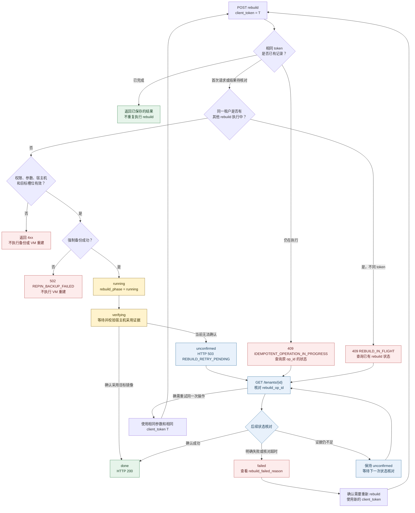

# Tenant Rebuild API

使用 Rebuild API 将已有租户重建到当前宿主机的 `live` 或 `canary` 镜像。

## Endpoint

```http
POST /tenants/{tenant_id}/rebuild
```

该接口仅允许管理员调用，并且始终同步执行。接口不会返回 `202 Accepted`。

## Authentication

请求需要携带有效的管理员凭证：

```http
Authorization: Bearer <admin-token>
Content-Type: application/json
```

非管理员调用返回：

```json
{
  "error": "rebuild requires admin role",
  "code": "ACCESS_DENIED"
}
```

## Request

请求体可省略。`image_channel` 未提供时默认为 `live`，与显式传
`"image_channel": "live"` 完全等价。

| Field | Type | Required | Description |
| --- | --- | --- | --- |
| `image_channel` | string | No | `live` 或 `canary`；默认 `live` |
| `client_token` | string | No | 调用方生成的幂等令牌；同一操作重试时必须复用原值 |
| `expected_image_snapshot_time` | string | No | 可选的 canary 版本一致性检查 |
| `expected_image_generation` | integer | No | 可选的 canary generation 一致性检查 |

服务端只会选择租户当前宿主机对应槽位中的版本，不接受请求直接指定任意镜像版本。

`client_token` 不需要从其他 API 获取。调用方应在第一次请求前生成一个唯一值，例如
UUID。每次新的 rebuild 使用新的 token；因网络超时或结果未确认而重试同一次 rebuild
时，必须复用原 token。

### Operation identifiers

| Field | Generated by | Purpose |
| --- | --- | --- |
| `client_token` | 调用方 | 在请求前标识一次逻辑操作，保证重试不会重复执行 rebuild |
| `op_id` | 服务端 | 在 POST 响应中标识服务端执行的 rebuild，用于状态关联 |
| `rebuild_op_id` | 服务端 | 在 `GET /tenants/{tenant_id}` 中标识最近一次 rebuild |

POST 响应中的 `op_id` 应与状态查询中的 `rebuild_op_id` 对照使用。`op_id` 不是请求
参数，也不能替代 `client_token`：如果原请求超时，调用方可能没有收到 `op_id`，仍须使用
原 `client_token` 重试。

### Default live

以下两个请求语义相同：

```bash
curl -X POST "$BASE_URL/tenants/$TENANT_ID/rebuild" \
  -H "Authorization: Bearer $ADMIN_TOKEN" \
  -H "Content-Type: application/json" \
  -d '{"client_token":"rebuild-20260813-001"}'
```

```bash
curl -X POST "$BASE_URL/tenants/$TENANT_ID/rebuild" \
  -H "Authorization: Bearer $ADMIN_TOKEN" \
  -H "Content-Type: application/json" \
  -d '{
    "image_channel": "live",
    "client_token": "rebuild-20260813-001"
  }'
```

如果租户此前固定在 canary 版本，选择 `live` 会将其切回当前宿主机的 live
镜像。

### Canary

```bash
curl -X POST "$BASE_URL/tenants/$TENANT_ID/rebuild" \
  -H "Authorization: Bearer $ADMIN_TOKEN" \
  -H "Content-Type: application/json" \
  -d '{
    "image_channel": "canary",
    "client_token": "rebuild-20260813-002",
    "expected_image_snapshot_time": "2026-08-13T02:15:30Z",
    "expected_image_generation": 7
  }'
```

`expected_image_snapshot_time` 和 `expected_image_generation` 用于避免在读取
canary 信息后，宿主机槽位已被其他操作替换。若不匹配，服务端返回
`409 CANARY_CHANGED`。

## Processing

服务端按以下顺序处理请求：

1. 验证管理员权限和请求参数。
2. 确认租户位于可执行 rebuild 的宿主机。
3. 确认所选 `live` 或 `canary` 槽位存在。
4. 完成强制备份。
5. 切换租户镜像 channel 并重建 VM。
6. 验证 VM 已采用目标镜像后返回成功。

如果所选槽位不存在，操作会在备份、channel 切换和 VM 重建前失败。服务端不会
自动回落到另一个 channel。

## State and Retry Flow



`status` 在 rebuild 期间可能一直是 `running`，不要用它判断 rebuild 进度。
`rebuild_status` 在 `running` 和 `verifying` 阶段可能不存在：

- `running`：服务端已开始执行 rebuild。
- `verifying`：宿主机命令已提交，服务端正在等待或校验采用证据。
- `unconfirmed`：本次同步请求未能确认结果；不要使用新 token 自动重试，先等待状态核对。
- `done`：已确认采用目标镜像，操作完成。
- `failed`：收到明确失败结果，或状态核对在规定时间内仍无法确认。重试前应查看
  `rebuild_failed_reason` 并确认租户的实际版本。

## Success

采用验证成功后返回 `200 OK`：

```json
{
  "id": "tenant-123",
  "status": "running",
  "rebuild_status": "done",
  "op_id": "6a2c..."
}
```

## Check Rebuild Status

通过 `GET /tenants/{tenant_id}` 查询最近一次 rebuild 的进度：

```bash
curl -s "$BASE_URL/tenants/$TENANT_ID" \
  -H "Authorization: Bearer $ADMIN_TOKEN"
```

不要只根据租户的 `status` 判断 rebuild 是否完成。rebuild 执行期间，租户的
`status` 可能仍为 `running`。请读取以下字段：

| Field | Meaning |
| --- | --- |
| `rebuild_op_id` | 最近一次 rebuild 的操作标识 |
| `rebuild_phase` | 当前阶段：`running`、`verifying`、`unconfirmed`、`done` 或 `failed` |
| `rebuild_status` | 当前结果：`done`、`unconfirmed` 或 `failed`；执行中可能不存在 |
| `rebuild_started_at` | 本次 rebuild 的开始时间 |
| `rebuild_failed_reason` | 未确认或失败原因；成功时不存在 |
| `rebuild_target_snapshot_time` | canary 目标版本；live rebuild 通常不存在 |

状态含义：

- `done`：服务端已确认 VM 采用目标镜像。
- `unconfirmed`：Host 可能已完成操作，但服务端尚未获得足够的采用证据；该状态可能
  继续收敛为 `done` 或 `failed`。
- `failed`：Host 返回明确失败，或后续状态核对超时；具体原因见
  `rebuild_failed_reason`。

同步请求返回 `503 REBUILD_RETRY_PENDING` 时，应先查询上述字段，并确认
`rebuild_op_id` 对应本次请求。需要重试时必须复用原请求的 `client_token`。

## Errors

| HTTP | Code | Meaning |
| --- | --- | --- |
| `400` | `VALIDATION` | 请求体、`image_channel` 或一致性参数无效 |
| `403` | `ACCESS_DENIED` | 调用者不是管理员 |
| `404` | `NOT_FOUND` | 租户或其当前宿主机不存在 |
| `409` | `NO_LIVE_VERSION` | 当前宿主机没有可用的 live 版本 |
| `409` | `CANARY_NOT_READY` | 当前宿主机没有可用的 canary 版本 |
| `409` | `CANARY_CHANGED` | canary 版本或 generation 与预期不一致 |
| `409` | `REBUILD_IN_FLIGHT` | 该租户已有 rebuild 正在执行 |
| `409` | `IDEMPOTENT_OPERATION_IN_PROGRESS` | 相同 `client_token` 对应的 rebuild 仍在执行 |
| `409` | `LIFECYCLE_SUPERSEDED` | 操作期间租户位置或生命周期所有权已变化 |
| `502` | `REPIN_BACKUP_FAILED` | 强制备份失败；未执行镜像切换或 VM 重建 |
| `503` | `REBUILD_RETRY_PENDING` | 未能确认本次采用结果 |

### Concurrent rebuild

同一租户上一笔 rebuild 尚未完成时，新的 rebuild 请求会在备份和 VM 重建前被
拒绝，并返回 `409 REBUILD_IN_FLIGHT`：

```json
{
  "error": "a rebuild is already in flight for this tenant",
  "code": "REBUILD_IN_FLIGHT",
  "id": "tenant-123",
  "rebuild_phase": "running",
  "rebuild_op_id": "6a2c..."
}
```

收到该错误后，不要使用新的 `client_token` 重复发起 rebuild。请通过
`GET /tenants/{tenant_id}` 查询 `rebuild_phase` 和 `rebuild_status`，并使用
`rebuild_op_id` 确认正在执行的操作。若原请求需要重试，必须复用原来的
`client_token`。

若使用相同 `client_token` 重试时原操作仍在执行，服务端返回
`409 IDEMPOTENT_OPERATION_IN_PROGRESS` 和原操作的 `op_id`。此时继续查询状态，
不要生成新的 token。

缺少 live 版本的响应示例：

```json
{
  "error": "target host has no READY live image version; pull or promote a live image before rebuilding",
  "code": "NO_LIVE_VERSION",
  "id": "tenant-123"
}
```

缺少 canary 版本的响应示例：

```json
{
  "error": "target host has no READY canary slot; pull the candidate image with slot=canary first (never falls back to live)",
  "code": "CANARY_NOT_READY"
}
```

## Retry Guidance

建议每次 rebuild 都提供唯一的 `client_token`。网络超时或收到
`503 REBUILD_RETRY_PENDING` 时：

1. 先通过 `GET /tenants/{tenant_id}` 查询 `rebuild_status`、`rebuild_phase` 和
   `rebuild_op_id`。
2. 不要创建新的 rebuild 请求。
3. 确认需要重试时，复用原请求的 `client_token` 和参数。

同一租户在已有 rebuild 执行期间再次调用会返回 `409 REBUILD_IN_FLIGHT`。
