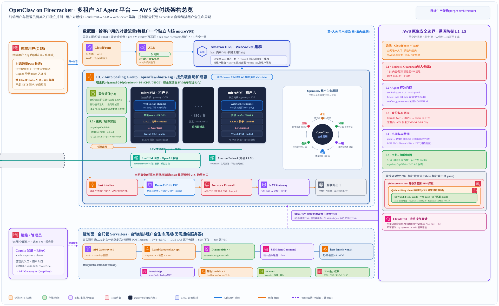

# 架构概述

本节介绍此解决方案的参考架构、组件之间的高级数据流，以及 AWS Well-Architected 框架的设计原则如何应用于该解决方案。

## 架构图

使用默认参数部署此解决方案将在您的 AWS 账户中部署以下组件。下图给出交付级架构总览：左侧数据面（终端用户经平台后端 WebSocket 网关 → Amazon CloudFront → Application Load Balancer → OpenResty 边缘 → 虚拟机内 OpenClaw gateway），中部控制面（全托管无服务器，编排租户全生命周期），右侧从 L1 到 L5 的纵深防御边界。

> **Note**
>
> 平台的 AWS 资源基于 AWS Cloud Development Kit (AWS CDK) 构造创建。AWS CDK 在部署时合成 AWS CloudFormation 模板并管理资源的生命周期。数据面（OpenResty 边缘 ASG + Amazon ElastiCache 路由存储，默认 Valkey、兼容 Redis）为 opt-in 能力，由 `config.yml` 的 `edge.enabled` / `redis.enabled` 控制；启用后详见"数据面两级路由"章。

使用 AWS CloudFormation 模板部署的解决方案组件，其高级流程如下。

1. 平台工程师或自动化程序通过 Amazon API Gateway 调用控制面 REST API，提交租户注册、生命周期、备份等管理操作。请求携带 `x-api-key`；启用 RBAC 时写操作另需携带 Amazon Cognito 签发的令牌（`Authorization: Bearer`），由控制面验签后按基于角色的访问控制（RBAC）授权。

2. Amazon API Gateway 调用 AWS Lambda 控制面函数，函数读写 Amazon DynamoDB 中的租户、宿主、技能分组等元数据，并向目标宿主派发虚拟机生命周期命令（默认经 AWS Systems Manager，大规模场景经 Amazon SQS 削峰后由宿主 agent 自取）。

3. 宿主（Amazon EC2 裸金属实例）由 Amazon EC2 Auto Scaling 组管理。新宿主启动后自举，下载只读黄金镜像、注册到宿主表，并在 KVM 之上为每个租户启动一台 Firecracker microVM。

4. 启动每台 microVM 前，宿主脚本将身份、技能、租户专属配置（gateway token、device 配对文件、计费虚拟密钥）冷注入到磁盘。microVM 挂载只读黄金镜像盘，启动即为成品。该步骤全部在 Firecracker `InstanceStart` 之前完成，对应"零运行时操作"。

5. 终端用户通过浏览器或前端向平台后端 WebSocket 网关发起 wss `/gw/ws` 连接，网关校验平台会话令牌（HS256 JWT，非 Cognito），前端不接触任何密钥。

6. 平台后端网关作为 WebSocket 客户端，经 Amazon CloudFront → Application Load Balancer → OpenResty 边缘连到目标 microVM 的 OpenClaw gateway，用 OpenClaw 原生 Ed25519 device 非对称握手认证（私钥由平台后端代持，公钥冷注入 microVM 配对文件）。

7. OpenResty 边缘按 `tenant_id` 查 Amazon ElastiCache 路由存储（`route:{tenant_id}`；Valkey/Redis wire protocol），经宿主 iptables DNAT 直投到对应 microVM gateway 的 18789 端口。microVM 只对宿主内部 TAP 网卡暴露该端口，不开放任何公网入站。

8. 控制面与数据面的关键事件经 Amazon CloudWatch 记录指标与日志；宿主探针暴露 Prometheus 指标供监控平台采集；安全相关事件可经 Amazon GuardDuty 与 Amazon EventBridge 汇入统一告警通道（默认关闭，按需启用）。

> **Note**
>
> 上述数据面链路取代了早期的"claw-hub WebSocket 中枢 + claw-channel 出站拨号 + Amazon Cognito 三处身份"模型（2026-07-08 数据面去中枢化改造，见"数据面两级路由"章）。旧模型的组件（claw-hub、claw-channel、hub 令牌、hub 代签 S3 预签名 URL）已从部署代码下线并归档。

## AWS Well-Architected 设计注意事项

平台采用 AWS Well-Architected 框架中的最佳实践，帮助客户在云中设计和运行可靠、安全、高效、经济实惠且可持续的工作负载。

本节介绍 Well-Architected 框架的设计原则与最佳实践如何使平台受益。

### 卓越运营

本节介绍平台如何运用卓越运营支柱的原则和最佳实践。

- 平台使用从 AWS CDK 构造合成的 AWS CloudFormation 模板，将所有资源定义为基础设施即代码。
- 平台遵循"改部署代码再重建"的纪律：身份、技能、配置的变更先落入构建脚本或启动模板，经灰度后滚动重建，出现问题时回滚镜像清单（manifest），避免热改运行中的虚拟机。
- 平台将指标推送到 Amazon CloudWatch，宿主探针额外暴露 Prometheus 指标，为虚拟机内存、磁盘、CPU、健康状态提供可观测性。
- 平台以"症状—定位—处置"的运维手册（runbook）覆盖常见故障，宿主探针对虚拟机异常具备两级自恢复能力。

### 安全性

本节介绍平台如何运用安全性支柱的原则和最佳实践。

- 平台的数据面身份根是 OpenClaw 原生 Ed25519 device 非对称认证（私钥平台后端代持、公钥冷注入 microVM）；控制面要求 usage-plan key 并叠加可选 Amazon Cognito RBAC。无效 Bearer token 无可信 owner 身份，受保护路由返回 `403`。
- 平台默认启用基于角色的访问控制（RBAC，`console_auth.rbac_enabled` 默认 `true`），强制按路由的角色检查与资源属主检查；即使关闭 RBAC，资源属主（`owner_id`）检查仍不受影响。
- 平台为每个租户预配独立内核的 Firecracker microVM，并在宿主 iptables 上丢弃跨租户东西向流量、丢弃虚拟机访问实例元数据服务（IMDS）与宿主管理端口的流量。
- 平台的 agent 工具执行层在工具真正执行前否决凭据外泄、敏感文件读取等危险动作，内容层经 Amazon Bedrock Guardrails 拦截越狱与有害内容。
- 平台的虚拟机为零凭据黄金镜像，不持有任何长期 AWS 凭据；身份与技能烤入只读盘，运行时无法篡改。
- 所有数据存储（Amazon S3 桶与 Amazon DynamoDB 表）默认加密；Amazon S3 资产桶封锁全部公网访问并强制 HTTPS。

### 可靠性

本节介绍平台如何运用可靠性支柱的原则和最佳实践。

- 平台尽可能使用 AWS 无服务器服务（AWS Lambda、Amazon API Gateway、Amazon S3、Amazon DynamoDB）以提高可用性并从服务故障中恢复。
- 平台的宿主由 Amazon EC2 Auto Scaling 组管理，宿主探针对虚拟机故障提供两级自恢复，控制面的健康检查函数对失联租户重启 agent。
- 平台为控制面元数据表启用时间点恢复（PITR），默认保留 35 天连续备份；租户数据由备份函数定期归档到启用了对象锁定的 Amazon S3 桶。
- 平台在删除租户数据前强制同步备份，备份失败则中止删除（fail-closed），避免不可逆的数据丢失。

### 性能效率

本节介绍平台如何运用性能效率支柱的原则和最佳实践。

- 平台在 Amazon EC2 裸金属实例上使用原生 KVM 运行 Firecracker，microVM 纯启动约 1.74s（裸金属实测，p50），从启动到 gateway 可用约 6.48s（实测）。
- 平台使用 AWS Graviton 处理器（Arm64）的裸金属机型作为生产底座，原生 KVM 运行 microVM，避免嵌套虚拟化的性能损耗。
- 平台以 Amazon SQS 削峰队列将大规模生命周期操作摊平成受控并发速率，规避 AWS Systems Manager 单实例并发配额成为瓶颈。
- 平台支持内存超卖回收（Firecracker balloon，`balloon.enabled` 默认开启并附带 `free_page_reporting`），单台裸金属实例全健康实测承载 187 个节点（受磁盘瓶颈约束，实测）。

### 成本优化

本节介绍平台如何运用成本优化支柱的原则和最佳实践。

- 平台的控制面采用无服务器架构，客户只需为实际用量付费；Amazon DynamoDB 按需计费，无预置成本。
- 平台的宿主可混合使用 Savings Plans 与 Spot 实例以降低计算成本，按 80% Savings Plans 加 20% Spot 测算约 $8.36/租户/月（成本推算）。
- 平台以每租户计费虚拟密钥将大模型调用花费按租户拆分，便于成本归因与预算控制。
- 平台的空闲宿主由扩缩容函数经两轮确认后受控回收，避免空转成本。

### 可持续性

本节介绍平台如何运用可持续性支柱的原则和最佳实践。

- 平台以独立内核 microVM 在单台裸金属实例上承载数百个租户，通过高密度复用降低单租户的资源足迹。
- 平台使用按需扩缩的托管服务与受控回收的宿主，使资源消耗贴合实际负载，减少空闲资源。
- 平台采用 AWS Graviton 处理器，在同等工作负载下相比同类计算具有更优的能效表现。
